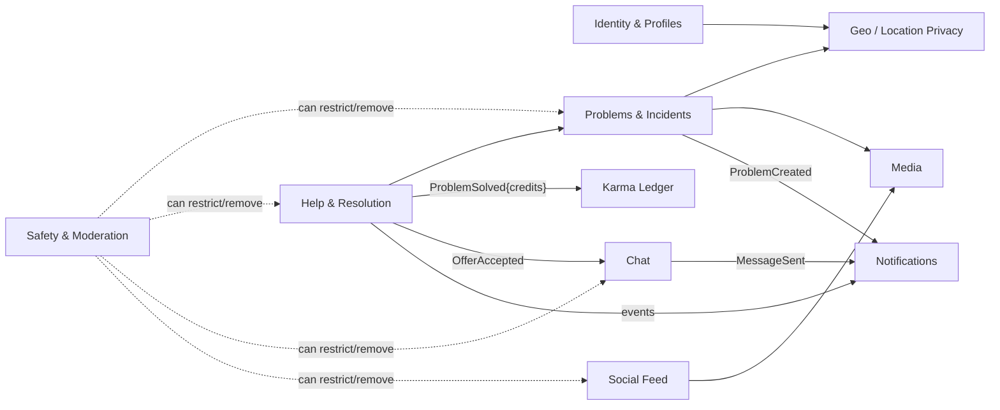
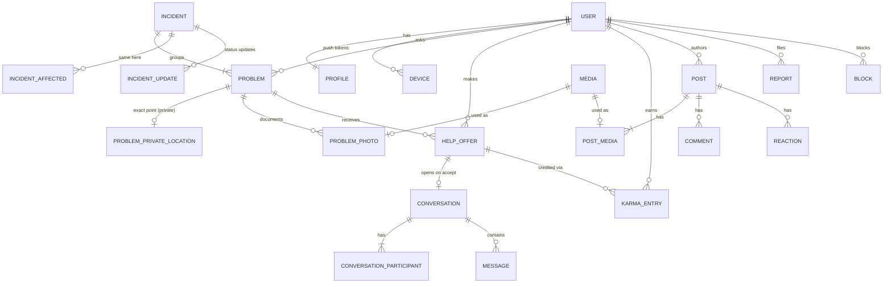
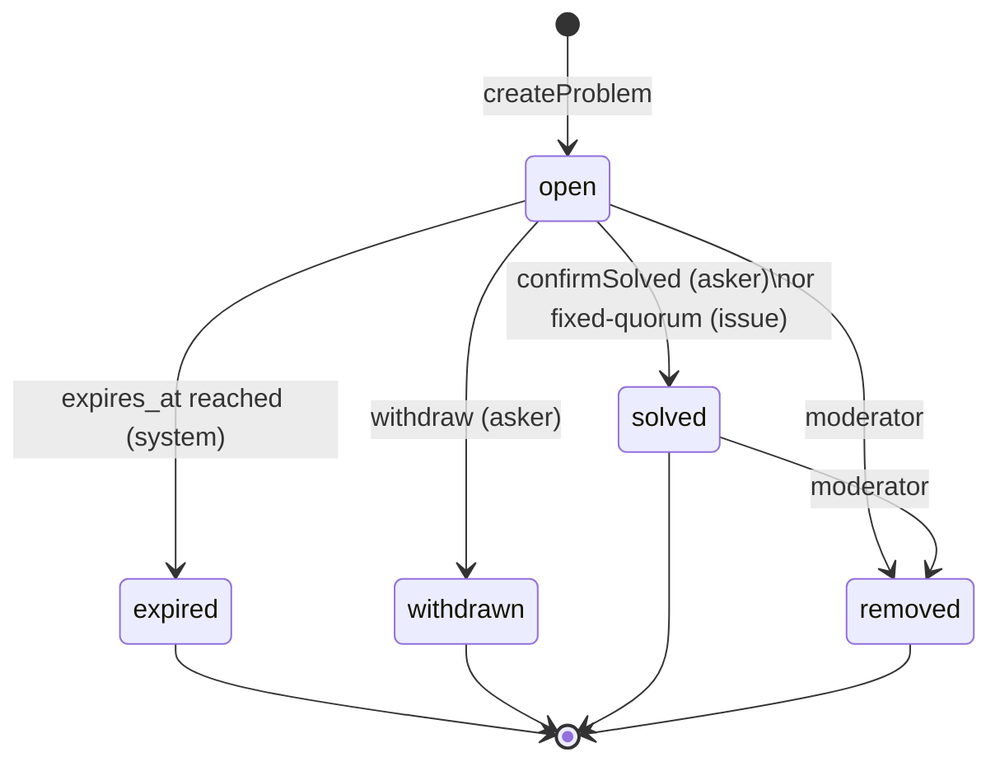
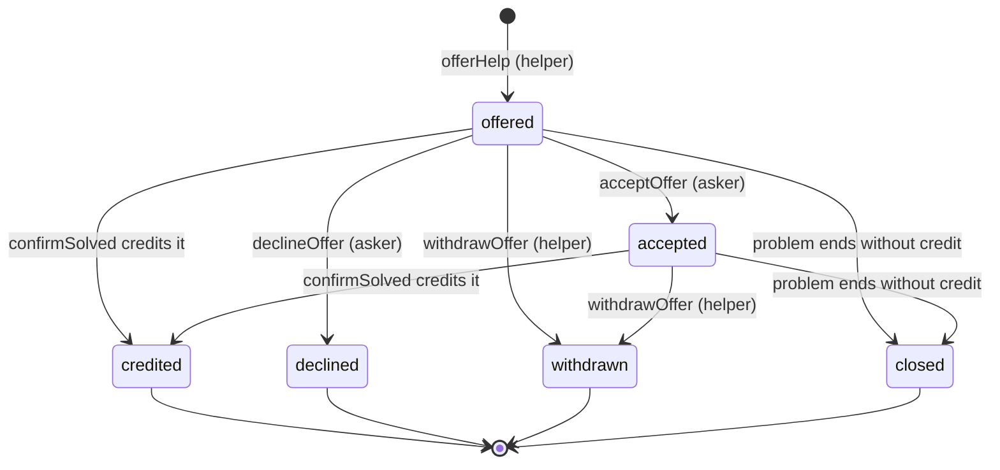

# 02 — Domain Model

> The vocabulary, entities, state machines and **business rules** of HelpIN.
> Rules are numbered (`R-xx`, `K-xx`, `L-xx`) so that each one maps to at least one automated test.
> The concrete SQL lives in [`schema-draft.sql`](schema-draft.sql).

---

## 1. Ubiquitous language

Use these words in code, UI copy, and conversation. One word per concept.

| Term | Meaning | Not to be confused with |
|---|---|---|
| **Problem** | One user's report of something that needs solving. Owned by its **asker**. | A feed *post* |
| **Incident** | The real-world thing a problem is about. One or more problems + "same here" users. **The map shows incidents.** | A problem (1 incident : N problems) |
| **Kind** | `request` (personal, a neighbour can solve) or `issue` (shared/civic). See Theory §5. | Category |
| **Category** | What it's about (Lost & found, Water, …). Sets the default kind and default urgency. | Kind |
| **Urgency** | `basic` · `medium` · `serious`. Always shown as a **label + icon + colour**, never colour alone. | Priority/ranking |
| **Area** | The public, approximate location of a problem: an H3 hexagon cell. | Exact location |
| **Help offer** | A helper saying "I can help" on a problem, optionally with a message. | A chat message |
| **Accept** | The asker accepts an offer, which opens a chat between them. | Credit |
| **Credit** | When confirming solved, the asker chooses which helpers actually helped. Credited helpers get karma. | Accept |
| **Same here** | A user marking themselves affected by an existing incident (mostly for issues). | Creating a duplicate problem |
| **Karma** | Reputation points, derived from the karma ledger. | Money (never) |
| **Post** | A normal social-feed photo post. Completely separate from problems. | Problem photo |
| **Launch area** | A configured region where HelpIN is open. | Area (a cell) |

---

## 2. Bounded contexts (modules)

The backend is a modular monolith (see Architecture §3). Each module owns its tables and talks to
other modules only through their public service interface or domain events, never by touching
another module's tables directly.

| Module | Owns | Key commands |
|---|---|---|
| Identity & Profiles | users, profiles, devices, blocks, notification prefs | signUp, updateProfile, setHomeArea, block |
| Geo | H3 snapping, locality names, launch areas | snapToArea, localityFor, isInLaunchArea |
| Problems & Incidents | incidents, problems, problem_photos, incident_affected, incident_updates, private locations | createProblem, markSameHere, withdraw, extend, postUpdate |
| Help & Resolution | help_offers, resolution logic | offerHelp, acceptOffer, declineOffer, withdrawOffer, claimSolved, confirmSolved, confirmFixed (issues) |
| Karma | karma_entries, cached balances | awardForSolve, reverseEntry |
| Chat | conversations, participants, messages | openForOffer, sendMessage, shareExactLocation |
| Social Feed | posts, post_media, comments, reactions | createPost, comment, react |
| Media | media objects, processing pipeline | requestUpload, finalizeUpload |
| Notifications | notifications, push delivery, fan-out | (event consumers only) |
| Safety & Moderation | reports, moderation_actions, rate limits, trust levels | report, resolveReport, restrictUser |

---

## 3. Entity overview

Notes on what changed from the original entity list, and why:

- **`solutions` + `problem_helpers` → one `help_offers` table.** A "solution" is just a helper's
  offer plus the conversation that follows. Two tables for one relationship invites
  inconsistency. Each helper has at most one offer per problem.
- **`incidents` added.** Every problem belongs to an incident from day one, even when the
  relationship is 1:1. That way AI clustering later is a background job that merges incidents,
  not a schema migration.
- **`problem_private_locations` split out.** The exact point lives in its own table that no
  public query ever joins. This is privacy by structure, not by discipline.
- **`media` added.** A single upload pipeline (EXIF stripping, resizing, moderation) serves problem
  photos, post photos, avatars and chat images. Usage is recorded in `problem_photos` and
  `post_media`, which keeps the two photo worlds separate.
- **`karma_transactions` → `karma_entries` (append-only ledger).**
- **`blocks`, `incident_affected`, `incident_updates`, `devices`, `moderation_actions`,
  `outbox_events` added.**

---

## 4. State machines

### 4.1 Problem

"Being helped" is **not a status**. It's derived from the count of accepted offers and shown as a
badge ("2 helping"). Keeping it out of the state machine avoids states flapping when helpers come
and go.

| Rule | |
|---|---|
| **R-01** | A problem is created `open` with `expires_at = now + TTL(urgency)`: serious 24 h, medium 3 d, basic 7 d (config). |
| **R-02** | Only the asker can `withdraw`, `extend`, or `confirmSolved`. |
| **R-03** | `extend` is allowed once, only while `open`, and adds one TTL. |
| **R-04** | `solved`, `expired`, `withdrawn`, `removed` are terminal. There's no reopen, so the user posts a new problem. This keeps karma consistent. |
| **R-05** | Terminal problems leave the active map immediately. They remain visible on the owner's profile and in solver history (except `removed`). |
| **R-06** | Every transition is written with an optimistic-concurrency check (`WHERE status = 'open'`). Double-taps and races can't double-solve or double-award. |
| **R-07** | Every command accepts an idempotency key. Replaying the same key returns the original result. |
| **R-08** | Before expiry: a push reminder at 24 h before `expires_at` (basic/medium), offering one-tap extend. |

### 4.2 Help offer

| Rule | |
|---|---|
| **R-10** | A user can't offer help on their own problem. |
| **R-11** | One offer per (problem, helper). Re-offering after `withdrawn` reuses the row and goes back to `offered`. A `declined` offer can't be re-offered. |
| **R-12** | Offers are only possible while the problem is `open`, and only if neither user has blocked the other. |
| **R-13** | `acceptOffer` creates the problem conversation (asker ↔ helper) and posts the offer's message as its first message. Before acceptance, the helper can't send further messages. Unwanted helpers therefore can't spam. |
| **R-14** | An accepted helper may `claimSolved` ("I think it's solved"). This doesn't change any state. It sets `claimed_solved_at` and sends the asker a one-tap confirm prompt. Reminders follow at +24 h and +72 h. |
| **R-15** | An offer can be **credited** from `offered` *or* `accepted`. Info-only help ("the water's back at 6") counts even if the asker never opened a chat. |
| **R-16** | When a problem reaches a terminal state, all non-terminal offers that weren't credited become `closed`. |

### 4.3 Confirm solved (the critical transaction)

`confirmSolved(problemId, creditedOfferIds[0..3], idempotencyKey)`, all in **one database
transaction**:

1. Lock the problem row; assert `status = 'open'` and caller is the asker (R-02, R-06).
2. Assert every credited offer belongs to this problem, isn't the asker's, and is in
   `offered|accepted` (R-15, K-03, K-04).
3. Problem → `solved`, `solved_at = now`. Incident status is recomputed (§4.5).
4. Credited offers → `credited`; others → `closed` (R-16).
5. For each credited offer, the Karma module computes the award (§6) and appends ledger entries.
6. Schedule deletion of the private exact location (L-07).
7. Append outbox events `ProblemSolved` and `HelperCredited×n` (these drive the push, the map
   refresh and the analytics events).

Zero credits is valid ("I solved it myself" / "it resolved on its own").

### 4.4 Issue resolution (kind = `issue`)

| Rule | |
|---|---|
| **R-20** | The reporter (asker) can `confirmSolved` exactly as in §4.3. |
| **R-21** | Users with an `incident_affected` row may tap **"Fixed now"**. When **3** distinct affected users (config) have confirmed within 48 h, the problem is `solved` with **no credits** by the system. |
| **R-22** | After a fixed-quorum solve, the reporter has **72 h** to credit helpers (`creditAfterSolve`). The same karma rules apply. |
| **R-23** | Affected users, the reporter, and helpers with an offer may post short public **updates** ("Complaint filed, ref #123", "Water back on Block C"). Updates are text-only and rate-limited. |

### 4.5 Incident

| Rule | |
|---|---|
| **R-30** | Creating a problem creates a new incident unless the user chose an existing nearby incident via "Same here" (in which case **no new problem is created**, only an `incident_affected` row). |
| **R-31** | Before creating, the client shows open incidents of the same category within the same area and its ring-1 neighbours ("Is it one of these?"). This manual deduplication is the MVP replacement for AI clustering, and every "same here" tap is a labelled training example. |
| **R-32** | Incident display fields (`affected_count`, `max_urgency`, `status`) are recomputed whenever a member problem or affected row changes. An incident is `open` while any member problem is open. |
| **R-33** | Map card prominence = f(affected_count, urgency). Implemented client-side from those two fields. |
| **R-34** (later) | Incident merge: re-point problems to the surviving incident, union affected users, write `incident_merges` (for audit/undo). No other table changes. |

---

## 5. Location privacy model

The most important privacy decisions in the product.

### 5.1 Why hexagon snapping, not random jitter

Random jitter (moving a pin by a random 200 m) **fails under repetition**. If someone posts 5
problems from home, averaging the jittered pins reveals their house. Snapping to a **fixed grid
cell** always gives the same answer for the same place, so there's nothing to average. HelpIN
uses Uber's **H3** hexagonal grid:

| H3 resolution | Avg cell area | Avg edge | Used for |
|---|---|---|---|
| 7 | ~5.2 km² | ~1.2 km | "Wider area" option; notification subscriptions; feed locality |
| **8** | **~0.74 km²** | **~460 m** | **Default public area for problems** |
| 9 | ~0.1 km² | ~175 m | Opt-in for `issue` kind only (public places like a pothole) |

### 5.2 Rules

| Rule | |
|---|---|
| **L-01** | Public area of a problem = its H3 cell at the chosen resolution. The public map position = **cell centre**, never the exact point. |
| **L-02** | Default resolution 8. The asker may choose 7 ("wider area"). Resolution 9 is offered **only for `kind = issue`**. Requests about a person's home must never be that precise. |
| **L-03** | The exact point (GPS or dropped pin) is optional. It's stored only in `problem_private_locations`, which **no public API query reads**. A contract test asserts no public response contains it. |
| **L-04** | The exact point is revealed only when the asker taps **"Share exact location"** in a problem chat. It appears as a location message visible only to that conversation's participants. |
| **L-05** | Users' home area (for notifications/feed) is stored as an **H3 res-7 cell only**. The server never stores a user's exact home. |
| **L-06** | Viewer location: the client converts its own GPS to the cells it needs and queries by cell/viewport. The API doesn't log viewer coordinates. |
| **L-07** | Exact problem locations, and location messages in chat, are **hard-deleted 7 days after the problem becomes terminal** (data minimisation). |
| **L-08** | All uploaded images have EXIF/XMP metadata stripped (including GPS) server-side **before** they're readable by anyone but the uploader. |
| **L-09** | Locality label ("Near Indiranagar 2nd Stage") is reverse-geocoded from the **cell centre** and cached per cell. It never comes from the exact point. |
| **L-10** | Problems can only be created inside an enabled **launch area**. |

### 5.3 Visibility matrix

| Data | Any signed-in user | Accepted helper | Asker | Moderator |
|---|---|---|---|---|
| Category, kind, title, description, urgency | ✅ | ✅ | ✅ | ✅ |
| Area cell, locality label, cell centre | ✅ | ✅ | ✅ | ✅ |
| Problem photos (processed) | ✅ | ✅ | ✅ | ✅ |
| Asker display name, avatar, karma, neighbours helped | ✅ | ✅ | ✅ | ✅ |
| Counts: affected, offers, helping | ✅ | ✅ | ✅ | ✅ |
| List of offers + helper profiles | ❌ | own only | ✅ | ✅ |
| Problem chat | ❌ | ✅ (own) | ✅ | only when reported |
| Exact location | ❌ | only if shared in chat | ✅ | only when reported, audited |
| Blocked users' content | hidden | — | — | ✅ |

Signed-out visitors see nothing except the onboarding screens, which also reduces scraping.

---

## 6. Karma rules

Karma lives in an **append-only ledger** (`karma_entries`). `profiles.karma_balance` and
`profiles.neighbours_helped` are caches, updated in the same transaction and rebuildable from the
ledger at any time.

| Rule | |
|---|---|
| **K-01** | Each credited helper gets **+10** per solved problem (config: `karma.solve_award`). Same amount for request and issue in MVP. |
| **K-02** | At most **3** helpers credited per problem. |
| **K-03** | A helper must have an offer on the problem, created before the solve. |
| **K-04** | The asker can never credit themselves. |
| **K-05** | **Pair cooldown:** if this asker credited this helper within the last 7 days, the entry is written with `amount = 0, reason = 'pair_cooldown'`. Solver history still records the help. |
| **K-06** | **Pair lifetime cap:** karma from a single asker to a single helper is capped at 50. Beyond that, `amount = 0, reason = 'pair_cap'`. |
| **K-07** | **Eligibility:** the helper must be phone-verified and the account ≥ 24 h old, otherwise `amount = 0, reason = 'ineligible_account'`. |
| **K-08** | Entries are never updated or deleted. A moderator reversal appends an entry with `amount = −original` and `reverses_entry_id`. An entry can be reversed at most once. |
| **K-09** | `neighbours_helped` = number of **distinct askers** who credited this helper (non-reversed entries, including zero-amount ones). |
| **K-10** | **Velocity flags** (no automatic penalty, these create a moderation item): > 5 credits between the same pair in 30 days; > 15 credits to one helper in 24 h; > 5 solved problems in 24 h by one asker crediting the same helper. |
| **K-11** | Askers earn no karma in MVP (anti-farming). Revisit if the confirmation rate is low. |

Later (not MVP): weighting by urgency/impact, badges ("First Help", "10 Neighbours", "Water
Warrior"), solver levels, streaks, and decay of inactive reputation.

---

## 7. Chat rules

| Rule | |
|---|---|
| **C-01** | Conversations exist only in the context of a problem (`problem_id` required in MVP). There are no user-to-user DMs. |
| **C-02** | A conversation is created by `acceptOffer` (R-13), with exactly two participants: asker and helper. |
| **C-03** | Messages can be sent while the problem is non-terminal and for **48 h after** it becomes terminal (to say thanks / arrange returning a ladder). After that the conversation is read-only. |
| **C-04** | If either participant blocks the other, the conversation becomes read-only immediately for both. |
| **C-05** | Message types: `text`, `image` (via the media pipeline), `location` (L-04), `system` (e.g. "Marked as solved"). |
| **C-06** | Any message can be reported. A report gives moderators access to that conversation, and the access is audited. |

---

## 8. Social feed rules

| Rule | |
|---|---|
| **F-01** | Posts have 1–10 photos and an optional caption. A post is tagged with the author's **res-7 area** at posting time. |
| **F-02** | The feed shows posts from the viewer's area and ring-1 neighbours, newest first. No ranking algorithm in MVP. |
| **F-03** | Posts never appear on the map, and problems never appear in the feed. Media used by a post can't be attached to a problem, and vice versa. |
| **F-04** | Profile has two separate tabs: **Posts** (from `post_media`) and **Problem photos** (from `problem_photos` of problems the user asked, excluding `removed`). |
| **F-05** | One reaction type ("❤️") in MVP. Comments are flat (no threads). |

---

## 9. Safety, trust levels & rate limits

### Trust levels (derived, not stored as a manual flag)

| Level | Condition | Effects |
|---|---|---|
| `new` | Account < 7 days **or** never credited | Lower rate limits; can't post `serious` urgency without phone verification |
| `member` | ≥ 7 days and phone-verified | Normal limits |
| `trusted` | `neighbours_helped ≥ 5` and no upheld reports in 90 d | Higher limits; "Trusted neighbour" badge (later) |
| `restricted` | Set by moderator | Read-only; can't post, offer, or message |

### Default rate limits (config)

| Action | new | member / trusted |
|---|---|---|
| Create problem | 3 / day | 10 / day |
| `serious` problem | 1 / day | 3 / day |
| Help offers | 15 / day | 50 / day |
| Messages | 200 / day | 1000 / day |
| Posts | 3 / day | 10 / day |
| Reports | 10 / day | 20 / day |

### Safety rules

| Rule | |
|---|---|
| **S-01** | Users must be 18+ (self-declared at signup in MVP). |
| **S-02** | Selecting `serious` urgency shows a blocking interstitial: "HelpIN is not an emergency service. If anyone is in danger, call 112." ⚑ with a one-tap call button, before the problem can be posted. |
| **S-03** | Block is symmetric in effect: neither user sees the other's problems, offers, posts, comments, or messages. |
| **S-04** | Anything user-generated (problem, update, offer message, chat message, post, comment, profile) can be reported with a reason. |
| **S-05** | Content auto-hides once it has ≥ 3 distinct reports from `member`+ users, pending moderator review. |
| **S-06** | Every moderator action (remove, restore, restrict, reverse karma, view private data) is written to `moderation_actions`, which is append-only. |
| **S-07** | Account deletion is available in-app. It deletes the profile, posts, media and private locations, anonymises problems/messages ("Deleted user"), and keeps karma ledger rows anonymised for integrity. |

---

## 10. Domain events (outbox)

Written in the same transaction as the state change, then consumed asynchronously
(see Architecture §6).

| Event | Consumers |
|---|---|
| `ProblemCreated` | Notifications (nearby fan-out), Analytics, (later) AI dedupe |
| `IncidentAffectedAdded` | Notifications (to reporter, batched), Incident recompute |
| `HelpOffered` | Notifications (to asker) |
| `OfferAccepted` | Chat (open conversation), Notifications (to helper) |
| `SolveClaimed` | Notifications (to asker, + reminder schedule) |
| `ProblemSolved` | Notifications (helpers + affected), Map cache, Location purge scheduler, Analytics |
| `HelperCredited` | Notifications ("You earned 10 karma"), Profile cache |
| `ProblemExpired` / `ProblemWithdrawn` | Notifications (helpers with offers), Location purge scheduler |
| `MessageSent` | Notifications (if recipient not active in that chat) |
| `ContentReported` | Moderation queue, auto-hide check (S-05) |
| `MediaUploaded` | Media pipeline (strip, resize, scan) |
