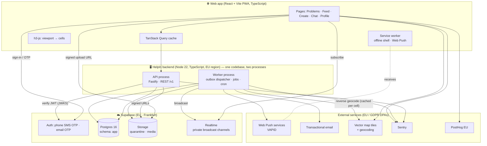
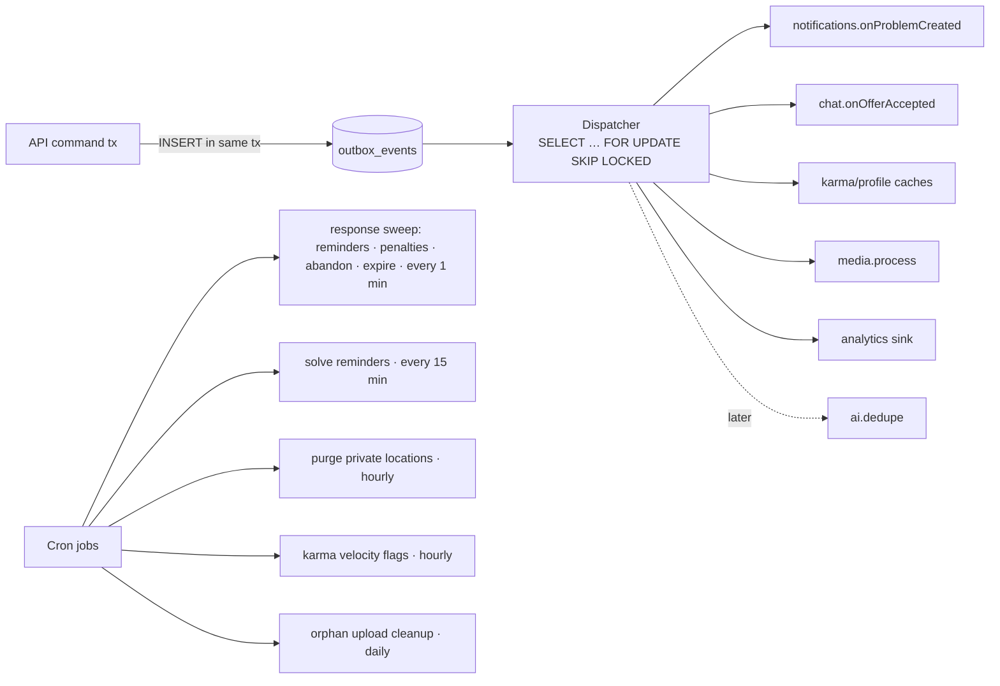

# 03 — Architecture

> How HelpIn is built: the stack, the modules, the data flows, and the paths for scaling and
> future features. Every choice here is recorded with alternatives in
> [05 — Decisions](05-decisions.md).
>
> **Launch context:** Budapest, Hungary (EU) · **web app first** (installable PWA), native mobile
> apps planned later · English UI.

---

## 1. Architectural drivers

What the architecture has to optimise for, in priority order:

1. **Correctness of the core loop.** Solve → credit → karma must never double-award, lose state,
   or leak location. Use transactions, idempotency and an append-only ledger.
2. **Privacy by structure, and GDPR by design.** Exact locations are physically separated and
   unreachable from public reads. All personal data is stored and processed in the EU.
3. **Small team, fast iteration.** One language (TypeScript) end to end, one database, one
   deployable backend, managed infrastructure.
4. **Extensibility without rewrites.** Native apps, AI clustering, payments and reputation
   upgrades plug in as new clients, modules or event consumers.
5. **Works well in any modern mobile browser**, on patchy mobile data, and can be installed to the
   home screen (PWA).

Non-goals for the MVP: native iOS/Android apps (planned next, reusing the API and shared
packages), microservices, multi-region, custom ML infrastructure.

---

## 2. System overview



**Key ideas**

- **The API is the only writer.** The web app never writes to Postgres directly. All tables live
  in a schema (`app`) that is *not* exposed through Supabase's auto-generated Data API, and Row
  Level Security is enabled with no policies as a second lock.
- **Postgres is the source of truth for everything**, including the job queue (outbox + jobs
  tables). There's no Redis in the MVP.
- **Realtime is a hint, not a source of truth.** Chat and status pushes arrive over Realtime. On
  reconnect the client refetches from the API, so a dropped socket never loses data.
- **Same code, two processes.** `api` serves HTTP. `worker` drains the outbox and runs scheduled
  jobs. They share modules and deploy from the same image.
- **Client-agnostic API.** The future native apps will be just another client of the same `/v1`
  API and shared packages.

---

## 3. Backend: modular monolith

### 3.1 Layout

```
apps/api/src/
├── server.ts                 # HTTP entrypoint
├── worker.ts                 # outbox dispatcher + cron entrypoint
├── platform/                 # cross-cutting, no business rules
│   ├── db.ts                 # pg pool, Kysely instance, withTransaction()
│   ├── auth.ts               # Supabase JWT verification → ctx.user (+ phone-verified check)
│   ├── errors.ts             # DomainError → HTTP mapping, stable error codes
│   ├── idempotency.ts        # Idempotency-Key store
│   ├── ratelimit.ts          # Postgres fixed-window counters
│   ├── outbox.ts             # appendEvent(tx, event); dispatcher
│   ├── storage.ts            # signed upload/download URLs
│   ├── push.ts               # Web Push (VAPID) sender; later also native push
│   ├── email.ts              # transactional email sender
│   ├── realtime.ts           # broadcast to private channels
│   └── logger.ts             # pino, request ids
└── modules/
    ├── identity/   { routes, service, repo, index }
    ├── geo/
    ├── problems/
    ├── help/
    ├── karma/
    ├── chat/
    ├── media/
    ├── feed/
    ├── notifications/
    └── safety/
```

### 3.2 Rules that keep it modular

1. A module exposes **only** `modules/<name>/index.ts`. A lint rule (dependency-cruiser) fails CI
   on any deep import across modules.
2. A module reads and writes **only its own tables**. Cross-module needs go through the other
   module's service API (synchronous, same transaction) or a domain event (asynchronous).
3. **Functional core, imperative shell.** Business decisions live in the pure `packages/domain`
   (no I/O):
   ```ts
   // packages/domain/src/resolution.ts
   decideConfirmSolved(input: {
     problem: ProblemSnapshot; caller: UserId; credited: OfferSnapshot[];
     pairHistory: PairHistory; helperEligibility: Map<UserId, Eligibility>; now: Date;
   }): Result<SolveDecision, DomainError>
   ```
   The service loads the snapshots (with row locks), calls the pure function, then persists the
   decision and appends outbox events in the same transaction. Every `R-/K-/L-` rule is unit-tested
   against these pure functions, with no database needed.
4. **Every command is a transaction**: lock → decide → write → append events → commit.

### 3.3 The confirm-solved flow end to end

```mermaid
sequenceDiagram
  autonumber
  participant A as Asker (browser)
  participant API as API (help module)
  participant DB as Postgres
  participant W as Worker
  participant H as Helper (browser / email)

  A->>API: POST /v1/problems/{id}/confirm-solved<br/>{creditedOfferIds:[o1]} + Idempotency-Key
  API->>DB: BEGIN; SELECT problem FOR UPDATE; SELECT offers FOR UPDATE
  API->>API: domain.decideConfirmSolved(...)  (R-02, R-06, R-15, K-01..K-07, K-11)
  API->>DB: UPDATE problem → solved; UPDATE offers → credited/closed
  API->>DB: INSERT karma_entries (helpers + asker closing award); UPDATE profile caches
  API->>DB: INSERT outbox_events (ProblemSolved, HelperCredited)
  API->>DB: COMMIT
  API-->>A: 200 {problem, credits}
  W->>DB: claim outbox rows (FOR UPDATE SKIP LOCKED)
  W->>H: Web Push (or email) "🎉 Anna confirmed you solved it (+10 karma)"
  W->>DB: schedule exact-location purge (L-07)
```

---

## 4. Repository layout (monorepo)

pnpm workspaces + Turborepo.

```
helpin/
├── apps/
│   ├── web/             # React + Vite PWA (the MVP client)
│   ├── api/             # Fastify API + worker (see §3)
│   ├── admin/           # (Phase 6) moderation console: React, same API
│   └── mobile/          # (later) native apps, to be planned after the web launch
├── packages/
│   ├── contracts/       # zod schemas for every request/response + inferred TS types
│   ├── domain/          # pure business rules & state machines (no I/O)
│   ├── geo/             # H3 snapping, viewport → cells, rings, resolution policy
│   ├── config/          # categories, response rule, rate limits, karma amounts (typed)
│   ├── api-client/      # typed fetch client + TanStack Query hooks (reused by native later)
│   └── db/              # SQL migrations, Kysely types (generated), seed data
├── infra/
│   ├── docker-compose.yml   # local Postgres for integration tests
│   └── env/                 # .env templates (no secrets committed)
├── docs/
└── .github/workflows/   # CI
```

`contracts`, `domain`, `geo`, `config` and `api-client` don't depend on the DOM, so the future
native apps can reuse them unchanged. Only the screens get rebuilt.

---

## 5. Data layer

- **Postgres 16**, Supabase-hosted in **EU (Frankfurt)**: close to Budapest, and keeps personal
  data in the EU (GDPR).
- **Migrations:** plain SQL files, applied with `dbmate` in CI/CD. The starting point is
  [`schema-draft.sql`](schema-draft.sql).
- **Query layer:** Kysely (type-safe SQL builder). Types are generated from the live schema with
  `kysely-codegen`, so the DB is the source of truth for types.
- **No PostGIS in the MVP.** All spatial logic runs on **H3 cell IDs** stored as indexed text
  columns. The queries we need are "which incidents are in these cells" and "which users have a
  home cell in this ring", and both are B-tree lookups. PostGIS can be added later for geofences
  or routing without changing existing tables.

### 5.1 Geo storage per problem

| Column | Example | Purpose |
|---|---|---|
| `area_cell`, `area_res` | `881e…ffff`, 8 | The public cell at the chosen resolution (L-01, L-02) |
| `cell_r8` | parent/self at res 8 | Map queries at street zoom |
| `cell_r7` | parent at res 7 | Notification fan-out, feed area |
| `cell_r6` | parent at res 6 | Zoomed-out cluster counts |
| `center_lat`, `center_lng` | cell centre | Where the card is drawn (never the exact point) |
| `problem_private_locations.lat/lng` | exact | Private, separate table, purged (L-03, L-07) |

The server computes every cell from the exact point (when given) or validates a client-supplied
cell. Cells are derived from H3, so the client can't spoof a mismatch.

### 5.2 Map query

```
GET /v1/map?bbox=minLng,minLat,maxLng,maxLat&zoom=15
```

1. The server picks a resolution from the zoom level (`geo.resolutionForZoom`): zoom ≥ 14 → res 8
   incidents, 11–13 → res 7 clusters, ≤ 10 → res 6 clusters.
2. It polyfills the bbox into cells at that resolution, capped at ~400 cells (rejecting oversized
   requests).
3. Incident mode:
   ```sql
   SELECT … FROM app.incidents
   WHERE cell_r8 = ANY($cells) AND status = 'open'
   ORDER BY max_urgency DESC, affected_count DESC LIMIT 200;
   ```
   Cluster mode: `SELECT cell_r7, count(*), max(max_urgency) … GROUP BY cell_r7`.
4. Blocked users' incidents are filtered out.

Indexes: partial B-tree `(cell_r8) WHERE status='open'`, same for `cell_r7` and `cell_r6`.

### 5.3 Data retention (GDPR storage limitation)

| Data | Retention |
|---|---|
| Exact problem location, location chat messages | Hard-deleted 7 days after problem is terminal (L-07) |
| Quarantine uploads (originals with EXIF) | Deleted immediately after processing; orphaned ones after 24 h |
| Chat messages | Kept while account exists; anonymised on deletion |
| Karma ledger | Kept for integrity, anonymised on account deletion |
| Moderation actions & DSA statements of reasons | Kept as required for legal/audit purposes |
| Outbox events | 14 days after processing |
| Idempotency keys | 48 h |
| Server logs | 30 days, with no coordinates, message bodies or tokens |

---

## 6. Async processing: outbox + worker



- **Transactional outbox.** Events are inserted in the same transaction as the state change, so
  an event exists if and only if the change committed.
- **At-least-once delivery.** Consumers must be idempotent. Each consumer records
  `(event_id, consumer)` in `outbox_deliveries` before acting, or its action must be naturally
  idempotent (upserts).
- **Retries** use exponential backoff (max 8 attempts). After that the event is parked with
  `status='dead'` and surfaced in admin/Sentry.
- **Cron** runs inside the worker process using a lease row so only one replica runs each job.
- **Why not a queue library or Redis now?** Postgres handles thousands of jobs per minute easily at
  MVP scale, and one fewer moving part is worth it. The `outbox` interface lets us swap in pg-boss
  or SQS later without touching modules.

---

## 7. Media pipeline

```mermaid
sequenceDiagram
  participant B as Browser
  participant API
  participant S as Storage
  participant W as Worker
  B->>B: pick/capture photo → resize & compress in browser (≤ 2048 px, JPEG 0.8)
  B->>API: POST /v1/media/upload-url {purpose, contentType, bytes}
  API->>API: validate type (jpeg/png/webp/heic) & size (≤ 10 MB), rate limit
  API-->>B: {mediaId, signedUploadUrl} (media.status = pending)
  B->>S: PUT original → quarantine/{userId}/{mediaId}
  B->>API: POST /v1/media/{id}/finalize
  API->>API: append MediaUploaded
  W->>S: download original
  W->>W: sharp: auto-rotate, STRIP ALL METADATA (EXIF/GPS), convert to WebP,<br/>sizes 1600 / 800 / 320, compute blurhash
  W->>W: content scan (interface; MVP = no-op + report-driven)
  W->>S: write media/{mediaId}/{size}.webp; delete quarantine original
  W->>API: media.status = ready
```

- `purpose ∈ {problem_photo, post_photo, avatar, chat_image}` is fixed at upload time. A media
  item can only be attached to an entity of the matching purpose. This enforces F-03 at the
  storage layer.
- Media is served through **short-lived signed URLs** (1 h) issued in API responses, so removed
  content stops loading quickly and nobody can hotlink.
- The original, with its EXIF/GPS, is never readable by anyone except the uploader (L-08). Browser
  resizing usually drops EXIF too, but the server **never relies on the client** for this.

---

## 8. Notifications

Notifications drive liquidity (Theory §4), so they get real design.

### 8.1 Channels on the web

| Channel | Used for | Notes |
|---|---|---|
| **Web Push** (service worker, VAPID) | Everything time-sensitive: nearby problems, offers, messages, response reminders | Works on Android Chrome, desktop browsers, and **iPhone only when HelpIn is added to the Home Screen** (iOS 16.4+) |
| **Email** | Fallback when the user has no active push subscription, and important account events | Loop events are sent immediately ("A helper is waiting for you"); nearby problems go out as a digest at most hourly |
| **In-app inbox** | Every notification | Always stored in `notifications` |

> ⚠️ **The biggest web-first weakness:** iPhone users get push only after installing the PWA to
> their Home Screen. Onboarding therefore includes a guided **"Add HelpIn to your Home Screen"**
> step on iOS, with email as the safety net. Push opt-in rate per platform is a launch metric. The
> native apps (planned next) remove this limitation.

### 8.2 Nearby-problem fan-out (`onProblemCreated`)

```
candidates = users where
     home_cell_r7 ∈ gridDisk(problem.cell_r7, k = user.alert_ring (0|1|2))
  OR (last_active_cell_r7 ∈ gridDisk(problem.cell_r7, 1) AND last_active_at > now - 2h AND user opted in)
  AND category ∈ user.alert_categories
  AND urgency ≥ user.alert_min_urgency
  AND user ≠ asker AND not blocked either way AND not restricted
  AND nearby_alerts_today < user.daily_cap (default 5; serious bypasses cap)
  AND not in quiet hours (serious bypasses only if user enabled "serious during quiet hours")
```

- If there are more than N candidates (default 150), rank by ring distance, then recent helpers
  first, then random. Send to the top N, and send to more after 20 minutes if there's still no
  offer. This avoids blasting a whole area and spreads load across helpers.
- Users' location for alerts is a **res-7 cell**, never a point (L-05).
- Channel per user: Web Push if subscribed, otherwise the hourly email digest.

### 8.3 Transactional notifications

| Trigger | Recipient | Example |
|---|---|---|
| HelpOffered | Asker | "Bence can help with *Need a ladder*" |
| OfferAccepted | Helper | "Anna accepted your help. Say hi 👋" |
| MessageSent | Other participant (if not viewing that chat) | Message preview |
| SolveClaimed + reminders | Asker | "Did Bence solve it? Tap to confirm" |
| ProblemSolved / HelperCredited | Helpers, affected users, asker | "🎉 +10 karma" / "+2 karma for closing your problem" / "Water issue marked fixed" |
| IncidentAffectedAdded (batched hourly) | Reporter | "5 more neighbours are affected" |
| ResponseDue (24 h / 44 h, personal problems with helpers) | Raiser | "Bence offered to help and is waiting for you" / "4 h left before you lose 5 karma", with actions **Still need help** · **It's solved** · **Withdraw** |
| RaiserPenalized | Raiser; helpers with offers | "You didn't respond for 2 days (−5 karma)" / "The asker hasn't responded in 2 days" |
| ProblemUpdated (batched 30 min) | Helpers with offers, affected users | "Anna updated: Partly solved, need one more person" |
| ProblemAbandoned | Raiser; helpers with offers | "Removed: no activity for 2 days" |
| ContentRemoved | Author | DSA statement of reasons: what was removed, why, and how to appeal |

Notification **action buttons** are used where the browser supports them. Every notification also
deep-links to a normal URL (`/p/{id}`, `/chat/{id}`), and that URL shows the same one-tap actions.

---

## 9. Realtime (chat & live status)

- Supabase Realtime **private broadcast channels**:
  - `conversation:{id}`: new messages and read receipts
  - `user:{id}`: personal events (offer accepted, credited, new notification badge)
- Channel authorisation is enforced by Supabase Realtime policies that check conversation
  membership (`app.conversation_participants`).
- **Flow:** API commits the message, then the outbox dispatches to the realtime consumer, then a
  broadcast is sent. The client appends it to the TanStack Query cache.
- **Healing:** on reconnect or tab focus, the client fetches
  `GET /conversations/{id}/messages?after={lastId}`. The API is always the source of truth.
- Fallback if Realtime is ever a problem: the same interface can be implemented with a WebSocket
  server inside the API process plus Postgres `LISTEN/NOTIFY`.

---

## 10. API design

- REST + JSON, versioned under `/v1`. Request/response schemas come from `packages/contracts`
  (zod), and OpenAPI is generated from them for docs and admin tooling.
- **Auth:** `Authorization: Bearer <Supabase access token>`, verified against Supabase JWKS. On
  first request, an `app.users` row is created from the token's `sub`. Every endpoint except
  onboarding requires a **verified phone number** (ADR-010).
- **CORS:** only the HelpIn web origins.
- **Commands** (POST) require an `Idempotency-Key` header (R-07).
- **Errors:** `{"error": {"code": "PROBLEM_NOT_OPEN", "message": "...", "details": {...}}}`. The
  codes are stable and the client switches on `code`, never on `message`.
- **Pagination:** opaque cursors (`?cursor=`), max 50 per page.

### Endpoint catalogue (MVP)

| Area | Endpoints |
|---|---|
| Me | `GET /me` · `PATCH /me/profile` · `PUT /me/home-area` · `PUT /me/alert-prefs` · `POST/DELETE /me/push-subscriptions` · `GET /me/export` (GDPR data export) · `DELETE /me` (account deletion) |
| Users | `GET /users/{id}` · `GET /users/{id}/solver-history` · `GET /users/{id}/posts` · `GET /users/{id}/problem-photos` (anonymous problems excluded, A-04) |
| Map & incidents | `GET /map?bbox&zoom` · `GET /incidents/similar?cell&category` · `GET /incidents/{id}` |
| Problems | `POST /problems` (with `anonymous` flag) · `POST /problems/{id}/withdraw` · `POST /problems/{id}/confirm-solved` · `POST /problems/{id}/credit` (after quorum, R-22) · `GET /me/problems` |
| Progress updates | `GET /problems/{id}/updates` · `POST /problems/{id}/updates` (raiser and helpers; affected neighbours on issues, R-40…R-46) · `POST /problems/{id}/still-need-help` (one-tap response, R-53) |
| Same here / issues | `POST /incidents/{id}/affected` · `DELETE /incidents/{id}/affected` · `POST /incidents/{id}/fixed` |
| Help | `POST /problems/{id}/offers` · `GET /problems/{id}/offers` (asker) · `POST /offers/{id}/accept` · `…/decline` · `…/withdraw` · `…/claim-solved` · `GET /me/offers` |
| Chat | `GET /conversations` · `GET /conversations/{id}/messages?before|after` · `POST /conversations/{id}/messages` · `POST /conversations/{id}/read` · `POST /conversations/{id}/share-location` · `POST /conversations/{id}/reveal-identity` (anonymous askers, A-03) |
| Media | `POST /media/upload-url` · `POST /media/{id}/finalize` · `GET /media/{id}` |
| Feed | `GET /feed` · `POST /posts` · `DELETE /posts/{id}` · `GET/POST /posts/{id}/comments` · `PUT/DELETE /posts/{id}/reaction` |
| Safety | `POST /reports` · `POST /blocks` · `DELETE /blocks/{userId}` · `GET /me/blocks` · `POST /appeals` (DSA) |
| Notifications | `GET /me/notifications` · `POST /me/notifications/read` |
| Meta | `GET /meta/config` (categories, urgency labels, limits, launch areas; versioned and cached) |
| Admin (role-gated) | `GET /admin/reports` · `POST /admin/reports/{id}/resolve` · `POST /admin/users/{id}/restrict` · `POST /admin/karma/{entryId}/reverse` · `POST /admin/content/{type}/{id}/remove|restore` · `GET /admin/appeals` |

---

## 11. Configuration as data

These live in `packages/config` and are served by `GET /meta/config`, so changing them doesn't
need a deploy of the client:

- **Categories:** `{ id, group, label_key, icon, default_kind, default_urgency, allowed_urgencies }`.
  Groups: People · Environment · Roads & public spaces · Utilities · Safety · Other
  (full catalogue: Domain Model §11).
- **Urgency:** labels, icons, colours.
- **Response rule:** response window (48 h), reminder points (24 h, 44 h), which kinds it applies
  to (personal only), and max lifetimes per (kind, urgency) (R-50…R-57); penalty amounts and
  escalation (K-12, K-13).
- **Karma:** award amounts (helper +10, asker closing +2), cooldowns, caps (K-01…K-07, K-11).
- **Anonymous posting:** eligibility (A-05).
- **Rate limits** per trust level.
- **Launch areas:** `{ id, name, cells_r7[], enabled, opened_at }`, e.g. a Budapest district.
  A launch area is a set of res-7 cells, checked with an O(1) lookup on create (L-10).
- **Feature flags:** `feed_enabled`, `issue_quorum_enabled`, … per launch area.

---

## 12. Web app architecture

| Concern | Choice |
|---|---|
| Framework | **React + TypeScript + Vite**, a single-page app. Everything is behind login, so there's no need for server rendering. |
| PWA | `vite-plugin-pwa` (Workbox): installable to the Home Screen, offline app shell, cached recent data, Web Push via the service worker |
| Routing | TanStack Router (type-safe URLs; every screen has a shareable URL) |
| Layout | Mobile-first. **Bottom tab bar on phones**, left sidebar on tablets/desktop: **Problems · Feed · ⊕ Create · Chat · Profile** |
| Server state | TanStack Query (hooks from `packages/api-client`), persisted to IndexedDB for fast reloads |
| UI | Tailwind CSS + Radix UI primitives (accessible dialogs, menus, tabs) |
| Forms | react-hook-form + zod schemas from `packages/contracts` |
| Map | **MapLibre GL JS** with vector tiles from an EU-friendly provider (e.g. MapTiler, or self-hosted Protomaps later). Incidents are drawn as **hexagon fill layers + a card marker at the cell centre**, never a pin at a point. |
| Geo | `h3-js` + `packages/geo` (same resolution policy as server) |
| Location | Browser Geolocation API (when the page is open only), with a **"pick on the map" fallback** when permission is denied |
| Media | `<input type="file" accept="image/*" capture>` → in-browser resize/compress → signed upload with retry; blurhash placeholders |
| Push | Service worker + Web Push (VAPID), with an **iOS "Add to Home Screen" guide** in onboarding |
| i18n | `i18next`. English at launch; every string is a key from day one, so Hungarian can be added later |
| Session security | Supabase JS session, strict Content-Security-Policy, HTTPS + HSTS, no third-party scripts except the ones listed |
| Errors | Sentry browser SDK |
| Accessibility | WCAG 2.1 AA target. Urgency = icon + text + colour; keyboard navigation; screen-reader labels on map cards; respects reduced-motion and dark mode |

### Screen map (URLs)

```
/welcome           → sign up / log in with phone (SMS code) or email (email code)
                   → verify phone number (required) → 18+ & community guidelines
                   → set home area → alert prefs → enable notifications (iOS: Add to Home Screen)
/problems          map (hexagons + cards) ⇄ list view · filter by category/urgency
/feed              local chronological photo feed
/create            fork: [Report a problem] (primary) | [Share a post]
                     problem: group → category → "is it one of these?" (similar incidents) → details
                              → area & precision → photos → urgency (serious ⇒ 112 interstitial)
                              → post as me / post anonymously → review → post
/p/:id             problem tab: details · photos · 📌 latest progress update + timeline · "Updated 2 h ago"
                     "I can help" / "Same here" · offers (asker) · [Post update] [Still need help] (asker)
                     "Reply within 18 h" banner (raiser, personal problems with helpers) · confirm solved
/chat              conversation list (grouped by problem)
/chat/:id          conversation
/profile, /u/:id   header (karma · neighbours helped · reliability · badges)
                     tabs: Posts | Problem photos | Solved history
/settings          alerts & notifications, blocked users, privacy, export my data, delete account,
                   guidelines, terms, privacy notice, imprint/contact
```

### Path to native apps (planned later)

The API, `contracts`, `domain`, `geo`, `config` and `api-client` packages are reused as they are.
The native app (likely Expo/React Native) rebuilds only the screens, swaps MapLibre GL JS for its
native equivalent, and adds native push alongside Web Push in `platform/push.ts`. This will be
planned separately after the web launch.

---

## 13. Security & compliance

| Area | Control |
|---|---|
| AuthN | Supabase Auth. Sign up / log in with **phone (SMS code) or email (email code)**. **Phone verification is mandatory** for every account (one account per phone number), done during onboarding. |
| OTP abuse | CAPTCHA (e.g. Cloudflare Turnstile) before sending any SMS; per-IP, per-number and per-country limits to stop SMS-pumping fraud; SMS limited to EU numbers at launch |
| AuthZ | Enforced in services on every command (owner/participant/role checks) and backed by domain rules. The client is never trusted. |
| DB exposure | App tables in schema `app` (not exposed via the Data API). RLS enabled with deny-by-default. Only the API's DB role has grants. |
| Web | Strict CSP, HSTS, `X-Content-Type-Options`, `frame-ancestors 'none'`; CORS limited to HelpIn origins; dependencies scanned in CI |
| Input | zod validation at the edge; length caps (title ≤ 80, description ≤ 1000, message ≤ 2000, caption ≤ 500); Unicode normalisation |
| Abuse | Per-user rate limits (Domain §9), per-IP limits on auth endpoints, upload size/type limits |
| Location privacy | Structural separation (L-03); **contract test** that walks every public response schema and fails if any field could carry exact coordinates |
| Anonymity | Anonymous problems hide the asker publicly, but the account is always known to HelpIn and moderators (accountable anonymity, Domain §12) |
| Media | EXIF stripping (L-08); re-encoding (neutralises malformed-image exploits); signed URLs |
| Secrets | Platform secret store; the web app only carries the public Supabase anon key, a domain-restricted map-tiles key, and the public VAPID key |
| Audit | `moderation_actions` append-only; admin access to private data is logged with a reason |
| Backups | Supabase daily backups + point-in-time recovery (Pro tier), stored in the EU; restore drill before public launch |

### Legal: EU / Hungary

> This is a planning checklist, not legal advice. Get a review by a Hungarian/EU lawyer before
> public launch.

| Law | What it means for HelpIn |
|---|---|
| **GDPR** (+ Hungarian authority NAIH) | Privacy notice; lawful basis per purpose (mostly contract + legitimate interest; consent for optional analytics); records of processing; **DPIA** recommended because of location data; data processing agreements with every processor (Supabase, hosting, SMS, email, map tiles, Sentry, PostHog); EU data residency; data-subject rights in-app: **export** (`GET /me/export`), **delete**, correct; breach procedure |
| **ePrivacy (cookies)** | Only strictly necessary storage by default, so no consent banner is needed. Optional analytics only with consent (or cookieless mode). |
| **Digital Services Act (DSA)** | HelpIn hosts user content, so it needs: an easy **notice-and-action** reporting mechanism (we have it); a **statement of reasons** sent to users when their content is removed or restricted; an **appeal** path (`POST /appeals`); clear terms & community guidelines; a public point of contact. Small/micro enterprises are exempt from some of the heavier obligations; the lawyer should confirm which apply. |
| **Imprint / contact** | Operator identity and contact details published on the site |
| **Emergency** | 112 is the EU-wide emergency number, so the "Serious" interstitial says "call 112" (S-02) |

---

## 14. Observability & analytics

- **Logs:** pino JSON with request id, route, user id (hashed), latency. Never log coordinates,
  message bodies, phone numbers, emails, or tokens.
- **Errors & performance:** Sentry (API, worker, web) with release tags; EU data region.
- **Health:** `GET /healthz` (process), `GET /readyz` (DB reachable, outbox lag < threshold).
- **Key alarms:** outbox lag > 2 min · dead events > 0 · push failure rate > 5% · 5xx rate > 1% ·
  SMS sends spike (pumping fraud).
- **Product metrics:** computed **from Postgres** (SQL views like `metrics_liquidity_daily`,
  `metrics_solve_rate_weekly`) because the DB is the truth. Client analytics (PostHog **EU**
  cloud, cookieless or consent-based) cover funnels and UX only: create-problem drop-off, time on
  map vs feed, push opt-in rate per platform, PWA install rate on iOS.

---

## 15. Testing strategy

| Layer | Tool | What |
|---|---|---|
| Domain rules | Vitest | One or more tests per rule ID (`R-06`, `K-05`, `A-02`, …). Test names include the ID so coverage of the rulebook is traceable. |
| Geo | Vitest + fast-check (property tests) | Snapping is deterministic; public centre ≠ exact point; res 9 only for issues; viewport cap. |
| API integration | Vitest + real Postgres (docker compose) | Every endpoint's happy path + main errors; **concurrency tests** (10 parallel `confirm-solved` → exactly 1 success, karma written once); idempotent replay; time-travel tests for the response rule. |
| Contracts / privacy | Vitest | Public schemas contain no exact-location fields and no anonymous-asker identity; responses validated against schemas in tests. |
| Web components | Vitest + React Testing Library | Urgency badge, create flow validation, offer list, anonymous display. |
| End-to-end | **Playwright** | The Definition of Done (Roadmap §4) as scripted flows with **two browser contexts** (asker + helper) against staging, on mobile viewports (iPhone + Android emulation) and desktop. |
| Accessibility | axe-core (in Playwright) | No serious WCAG violations on core pages. |

CI (GitHub Actions) on every PR: lint → typecheck → unit → integration (Postgres service
container) → build → Playwright against a preview deployment. Merging to `main` deploys to
staging; a tagged release deploys to production.

---

## 16. Environments & deployment

| Env | Web app | Backend | DB/Auth/Storage |
|---|---|---|---|
| Local | `pnpm dev` (Vite) | `pnpm dev` (API + worker) | Supabase CLI local stack (Docker) |
| Preview | Per-PR preview URL (static hosting) | Staging API | Staging Supabase |
| Staging | `staging.helpin…` | Fly.io (Frankfurt/Amsterdam region), 1 API + 1 worker | Supabase project `helpin-staging` (EU) |
| Production | Static hosting + CDN (e.g. Cloudflare Pages) | Fly.io EU, 2 API + 1 worker | Supabase project `helpin-prod` (EU, Pro) |

Migrations run as a release step before new code starts. They must be backward-compatible
(expand → migrate → contract) so a rollback never meets an incompatible schema. The web app is
static files, so rollbacks are instant.

Approximate MVP running cost (verify current pricing): Supabase Pro ~$25/mo · API/worker hosting
~$10–30/mo · static web hosting free tier · map tiles free tier, then usage-based · SMS
verification per message (the main variable cost, so OTP abuse controls matter) · email free tier
· Sentry/PostHog free tiers · domain name. There are no app-store fees until the native apps.

---

## 17. Scaling path (only when metrics demand it)

The MVP design comfortably handles a whole city like Budapest (~100k users, ≈ 2k problems/day,
≈ 50k messages/day) on one Postgres instance. In order, when needed:

1. Add read replicas for map/feed/profile reads.
2. Add Redis for rate-limit counters and hot map-cell caching.
3. Partition `messages` and `notifications` by month.
4. Split the notification fan-out into its own worker pool.
5. Add a CDN in front of media.
6. Shard by launch region if multi-city latency demands it. The H3 cell is a natural shard key.

---

## 18. Extension points (future features without rewrites)

| Future feature | Where it plugs in | Why it won't need a rewrite |
|---|---|---|
| **Native iOS / Android apps** | New client using the same `/v1` API and shared packages; native push added in `platform/push.ts` | API-first design; logic lives in packages, not screens |
| **Hungarian language** | Add a translation file | All strings are i18n keys from day one |
| **AI duplicate detection / incident clustering** | New `ai` module consuming `ProblemCreated`: embed title+description (pgvector), compare against open incidents in `gridDisk(cell_r8, 1)` + same category, then suggest or auto-merge via R-34 | Incidents already exist and every "same here" tap is labelled training data |
| **AI category suggestion / fake-problem detection** | `POST /problems/suggest-category`; text `Scanner` interface | Category is config-driven; the scanner hook already exists |
| **Advanced reputation / badges / levels** | New consumers of the karma ledger | The ledger holds full, immutable history |
| **Payments / paid tasks** | Separate `tasks` + `payments` modules with their own tables | Never touches `help_offers` or the karma ledger (Theory §3) |
| **Civic authority integrations** (e.g. Budapest district offices) | Consumer of `ProblemCreated` for `kind=issue` | Issue kind and category already modelled |
| **New cities** | Add a launch area (config) | Launch areas are data |
