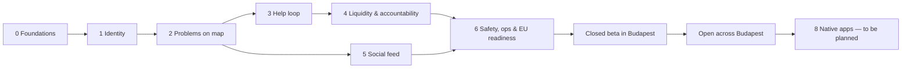

# 04 — MVP Roadmap

> The build order, with **exit criteria** for every phase. A phase is done when its exit
> criteria pass, not when its features "exist".

---

## 1. What changed from the original plan, and why

| Original plan | Revised | Reason |
|---|---|---|
| Chat in Phase 6 | Basic problem chat moves into the **help loop** (Phase 3) | DoD step 7 ("communicate with the relevant user") happens *before* the solution. Without chat the core loop can't be tested end to end. |
| Moderation, report/block in Phase 8 | Report/block **ships with each UGC feature**. The admin console is Phase 6. | Safety ships with the feature (Theory §7). The EU Digital Services Act requires a reporting mechanism, and app stores will too when native apps come. |
| No notifications anywhere | Transactional push in Phase 3, **nearby fan-out in Phase 4** | Notifications are the liquidity engine (Theory §4). Without them the map is empty. |
| "Solved" = owner confirms, for everything | Adds `kind = issue` with "same here", updates, and fixed-quorum resolution | Civic issues have many affected users and are rarely solved by one neighbour. |
| Duplicate grouping deferred to AI | `incidents` from day one + manual **"Same here"** | AI later becomes a background job, with labelled data already collected. |
| Photos: just "upload" | One media pipeline with **EXIF/GPS stripping** | Photos otherwise leak exact locations. |
| No launch strategy | Phase 7: city-wide Budapest launch run as many small networks: seed hubs, founding helpers, liquidity per district | Hyperlocal apps live or die on local density. |
| Problem details fixed after posting | **Progress updates** timeline on every problem tab (Phase 2) | Helpers need to know what is still needed *now*. |
| Problems stay until closed | **Response rule** (personal problems): once help starts, the raiser must respond within 2 days or lose karma; removed if nobody is active. Community problems exempt. (Phase 4) | Keeps the map live, respects helpers' time, and fixes the "never confirmed" problem. |
| A short category list | **Any problem:** Everyday help, Newcomers & language, Environment (garbage, rivers, ponds, parks…), Roads, Utilities, Safety, Other | Matches what people actually need to post. |
| Mobile app (Expo) | **Web app first** (installable PWA), native apps later (Phase 8) | Founder decision: fastest way to launch; no app-store review. |
| Market not specified | **Budapest, Hungary (EU)**, English UI | Founder decision; adds GDPR and DSA work to Phase 6. |

---

## 2. Phases

Sizes are relative (S ≈ a few days, M ≈ 1–2 weeks, L ≈ 2–3 weeks for one developer working with
an AI coding assistant). They're for ordering, not for promises.

### Phase 0 — Foundations · S

**Scope:** monorepo (pnpm + Turborepo), TypeScript strict, lint (incl. module-boundary rule),
Vitest, Playwright, CI on GitHub Actions; `packages/config`, `contracts`, `domain`, `geo`,
`api-client` skeletons; Supabase local stack (EU project for staging); SQL migrations from
`schema-draft.sql`; **web app shell** (React + Vite PWA) with the 5 tabs (bottom bar on phones,
sidebar on desktop), design tokens (urgency colour + icon + label), MapLibre map placeholder; i18n
scaffold (English); Sentry wired; per-PR preview deployments.

**Exit criteria**
- `pnpm i && pnpm test && pnpm build` passes in CI on a clean checkout.
- `pnpm dev` starts web, API, worker, and local Supabase. The app opens in a phone browser, shows
  the empty tabs, and can be installed to the Home Screen.
- Migrations apply to an empty DB and are re-runnable in CI.

### Phase 1 — Identity & profile · M

**Scope:** sign up / log in with **phone (SMS code) or email (email code)**; **mandatory phone
verification** (one account per number) with CAPTCHA + SMS rate limits; onboarding (18+,
community guidelines, home area as a res-7 cell, alert prefs, **enable notifications** with the
iOS "Add to Home Screen" guide); Web Push subscriptions + email channel; profile view/edit
(avatar via media pipeline); block list; account deletion; **data export** (GDPR);
`GET /meta/config`; privacy notice, terms and imprint pages (drafts).

**Exit criteria**
- A new user can sign up with email, is required to verify a phone number, sets a home area, and
  sees their (empty) profile with Karma 0. The same works when signing up with a phone number.
- A second account can't be created with an already-verified phone number.
- The DB never contains the user's exact home coordinates (verified by test, L-05).
- Account deletion removes or anonymises the user's data (S-07). Data export returns all their
  data (S-08).
- A test push reaches Android Chrome, desktop, and an iPhone with HelpIn installed to the Home
  Screen. Email is used when no push subscription exists.

### Phase 2 — Problems on the map · L

**Scope:** media pipeline (signed upload → worker strips EXIF → WebP sizes); create-problem flow
(group → category → similar incidents / "Same here" → details → area & precision → photos →
urgency with 112 interstitial → **post as me / post anonymously**); full category catalogue
(Domain §11); incidents created 1:1; map endpoint (incident & cluster modes) with hexagon
rendering in MapLibre; problem tab; **progress updates** (statuses, text, photos, pinned latest,
timeline, "Updated X ago" on cards); withdraw; max-lifetime expiry; report a problem or update
(including "Fake problem"); launch-area check.

**Exit criteria**
- User A creates a problem with a photo. User B, ~1 km away, sees it on the map as a hexagon area
  and opens it.
- Downloaded problem photos contain **no EXIF/GPS** (automated test on a GPS-tagged fixture).
- No public endpoint response contains exact coordinates (contract/privacy test green).
- An anonymous problem shows "Anonymous neighbour" everywhere public, never appears on the
  asker's profile, and no public response contains the asker's id (A-01, A-04 tests).
- Problems that reach max lifetime leave the map (R-01, R-05 tests).
- The asker posts a "Partly solved" update with a photo. Another user sees it pinned on the
  problem tab and summarised on the map card (R-40, R-41). The photo shows under the asker's
  Problem photos, never the feed (R-44).
- "Same here" increases `affected_count` and no new problem is created (R-30).

### Phase 3 — The help loop · L  ← **the heart of the MVP**

**Scope:** offers (offer / accept / decline / withdraw); conversation opened on accept with
Realtime chat (text, image, share exact location, reveal identity for anonymous askers);
claim-solved; **confirm-solved with credits** (single transaction); karma ledger (helper +10,
asker closing +2) + profile caches; solver history; transactional Web Push/email notifications +
in-app notification inbox; report/block for offers and messages.

**Exit criteria**
- Two test users complete DoD steps 1–12 in two browsers (Playwright, two contexts).
- Concurrency test: 10 parallel confirm-solved calls → exactly one succeeds, karma written once (R-06).
- All K-rules (K-01…K-11) have passing tests, including pair cooldown, ineligible accounts, and
  the asker closing award's conditions and weekly cap.
- Blocking during a chat makes it read-only for both (C-04).
- Closing the tab mid-chat and reopening shows every message (Realtime healing).

### Phase 4 — Liquidity, accountability & issues · M

**Scope:** nearby fan-out (rings, categories, daily caps, quiet hours, ranking, second wave;
Web Push or hourly email digest); **raiser response rule** for personal problems (48 h clock from
the first help offer, reminders at 24 h and 44 h, −5/−10 karma penalties, `on_notice` limit,
removal when nobody is active for 48 h, helper updates keep the tab alive, reliability %); one-tap
"Still need help" / "It's solved" / "Withdraw" from the notification; helper update notifications
(batched); issue kind: updates, "Fixed now" quorum (R-21), credit-after-solve (R-22); honest
empty states; list-view toggle on the map.

**Exit criteria**
- A new problem notifies eligible nearby users within 60 s (p95) and never blocked users, the
  asker, or users over cap (tests).
- An issue with 3 "Fixed now" confirmations auto-solves (R-21).
- Time-travel tests for the response rule (R-50…R-60, K-12…K-15):
  - no help offer → no clock and no penalty, ever;
  - first offer → reminders at 24 h and 44 h → penalty at 48 h, once per problem;
  - any raiser response (accept, decline, chat reply, update, Still need help) resets the clock;
  - raiser silent but a helper posts updates → penalty applied, but the problem stays on the map;
  - nobody active for 48 h → `abandoned` and removed;
  - community problems never get a clock, a penalty, or removal for silence;
  - withdrawing never penalises; reaching max lifetime expires without penalty.
- Escalation: the 3rd penalty in 30 days puts the user on notice (1 problem/day for 14 days).
- The confirm-solved prompt can be completed straight from the notification link.

### Phase 5 — Social feed · M

**Scope:** create post (1–10 photos, caption); local chronological feed (F-02); comments,
reactions; profile tabs **Posts | Problem photos | Solved history** (F-04); report/block on posts
& comments; feature flag `feed_enabled` per launch area (**on** for the beta).

**Exit criteria**
- DoD steps 13–14 pass.
- Feed photos never appear on problems and vice versa (F-03 test at API and storage-purpose level).
- The feed can be switched off per launch area without a deploy.

> **Beta-ready.** Core loop + feed work end to end. The closed beta (Phase 7 step 1) can start
> once Phase 6's legal and moderation minimum is in place.

### Phase 6 — Safety, ops & launch readiness (EU) · M

**Scope:** admin console for the founder as sole admin (report queue, content remove/restore,
restrict user, karma reversal, fake-problem penalty, audit log; **2FA required**; admin bootstrapped
from a private `ADMIN_EMAILS` secret; instant alerts for Serious reports); **DSA**: statement of reasons to users, appeals queue, public
contact point; auto-hide at 3 reports (S-05); karma velocity flags (K-10); metrics SQL views +
dashboard; alarms (incl. SMS-fraud spikes); load test (map + chat at 10× expected beta load);
backup restore drill; **GDPR** (founder as individual controller): final privacy notice, records of processing, DPIA, data
processing agreements with all processors, cookie check; terms, community guidelines (incl. no
fake problems), imprint; legal review.

**Exit criteria**
- The admin can only log in with 2FA, and can process a report end to end in the admin console. The user receives a statement
  of reasons and can appeal, and every action is in `moderation_actions`.
- GDPR/DSA checklist (Architecture §13) is complete and reviewed by a lawyer.
- Load test passes with p95 API latency < 300 ms.
- A database restore was rehearsed successfully.
- Accessibility check (axe) shows no serious violations on core pages.

### Phase 7 — Launch across Budapest · ongoing

1. **Closed beta (founding helpers):** recruit founding helpers in the seed hubs (District XI,
   VIII–IX, inner city V–VII & XIII; Theory §4), while the app covers all of Budapest. Seed with
   real problems.
2. **Open beta, city-wide.** Track liquidity **per district** every week; a district is healthy at
   ≥ 60%.
3. **Recruitment follows the data:** each week, focus recruitment and promotion on the districts
   with the most unanswered problems.
4. **Next city** only when Budapest holds its targets. Expansion is a config change (launch area
   + feature flags).

### Phase 8 — Native mobile apps · to be planned

Planned after the web launch, using real usage data: iOS/Android apps on the same API and shared
packages, with native push. Hungarian language is planned in the same window.

---

## 3. Dependency graph

---

## 4. Definition of Done (core MVP), mapped to tests

All end-to-end checks run in **Playwright** on mobile viewports (iPhone and Android emulation)
and desktop.

| # | A user can… | Phase | Automated by |
|---|---|---|---|
| 1 | Create an account (phone or email) and verify their phone | 1 | Playwright `signup.spec` |
| 2 | Open the map | 2 | Playwright |
| 3 | See nearby active problems | 2 | API integration (map query) + Playwright |
| 4 | Open a problem | 2 | Playwright |
| 5 | See its approximate area, description, urgency, photos and latest progress | 2 | Playwright + privacy contract test |
| 6 | Offer help | 3 | API integration + Playwright |
| 7 | Communicate with the relevant user | 3 | API integration (chat) + Playwright (two contexts) |
| 8 | Provide a solution | 3 | Playwright (claim solved) |
| 9 | Have the solution confirmed | 3 | Domain unit + API integration + Playwright |
| 10 | See the problem close automatically | 3 | API integration (map no longer returns it) |
| 11 | Receive karma for successful help (and the asker a little for closing) | 3 | Domain K-rules + API integration |
| 12 | View their karma and history on their profile | 3 | Playwright |
| 13 | Separately post ordinary photos to the social feed | 5 | API integration + Playwright |
| 14 | See feed photos and problem photos separated on their profile | 5 | API integration (F-04) + Playwright |

**Added non-negotiables (beyond the original 14):**

| # | Requirement | Phase |
|---|---|---|
| 15 | No public response contains exact coordinates; photos are EXIF-free | 2 |
| 16 | Any problem, offer, message, post, comment or user can be reported (incl. "Fake problem"), and any user blocked | 2–5 (with each feature) |
| 17 | Nearby users get notified of new problems, within their limits (Web Push or email) | 4 |
| 18 | Serious urgency shows the "not an emergency service, call 112" interstitial | 2 |
| 19 | Users can delete their account and export their data in-app (GDPR) | 1 |
| 20 | The asker can post progress updates (status, text, photos) that helpers see pinned on the problem tab | 2 |
| 21 | Once help starts on a personal problem, a raiser who doesn't respond for 2 days loses karma (after reminders), and a problem nobody updates for 2 days is removed. Community problems are never penalised. | 4 |
| 22 | Any kind of local problem can be posted: people, environment (dirty areas, rivers, ponds, parks), roads, utilities, safety, other | 2 |
| 23 | Problems can be posted anonymously; the asker is hidden publicly but accountable to HelpIn | 2 |
| 24 | Users whose content is removed get a statement of reasons and can appeal (DSA) | 6 |

---

## 5. First tasks when we start building

1. Confirm the open questions in [05 — Decisions §2](05-decisions.md#2-open-questions-for-the-founder).
2. Phase 0: scaffold the monorepo and CI, and turn `schema-draft.sql` into migration `0001`.
3. Write `packages/domain` with the problem/offer state machines and karma rules **test-first**,
   using the rule IDs from [02 — Domain Model](02-domain-model.md). This is the core of the product
   and doesn't need any UI to be proven correct.
