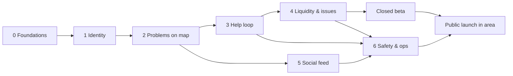

# 04 — MVP Roadmap

> The build order, with **exit criteria** for every phase. A phase is done when its exit
> criteria pass, not when its features "exist".

---

## 1. What changed from the original plan, and why

| Original plan | Revised | Reason |
|---|---|---|
| Chat in Phase 6 | Basic problem chat moves into the **help loop** (Phase 3) | DoD step 7 ("communicate with the relevant user") happens *before* the solution. Without chat the core loop can't be tested end to end. |
| Moderation, report/block in Phase 8 | Report/block **ships with each UGC feature**. The admin console is Phase 6. | Safety ships with the feature (Theory §7). App stores require report/block for UGC apps. |
| No notifications anywhere | Transactional push in Phase 3, **nearby fan-out in Phase 4** | Notifications are the liquidity engine (Theory §4). Without them the map is empty. |
| "Solved" = owner confirms, for everything | Adds `kind = issue` with "same here", updates, and fixed-quorum resolution | Civic issues have many affected users and are rarely solved by one neighbour. |
| Duplicate grouping deferred to AI | `incidents` from day one + manual **"Same here"** | AI later becomes a background job, with labelled data already collected. |
| Photos: just "upload" | One media pipeline with **EXIF/GPS stripping** | Photos otherwise leak exact locations. |
| No launch strategy | Phase 7: one launch area, founding helpers, liquidity gate | Hyperlocal apps live or die on local density. |
| Problem details fixed after posting | **Progress updates** timeline on every problem tab (Phase 2) | Helpers need to know what is still needed *now*. |
| Problems stay until closed | **Check-in rule:** asker must keep updating; silence → removed + karma penalty (Phase 4) | Keeps the map live and fixes the "never confirmed" problem. |
| A short category list | **Any problem:** People, Environment (garbage, rivers, ponds, parks…), Roads, Utilities, Safety, Other | Matches what people actually need to post. |

---

## 2. Phases

Sizes are relative (S ≈ a few days, M ≈ 1–2 weeks, L ≈ 2–3 weeks for one developer working with
an AI coding assistant). They're for ordering, not for promises.

### Phase 0 — Foundations · S

**Scope:** monorepo (pnpm + Turborepo), TypeScript strict, lint (incl. module-boundary rule),
Vitest, CI on GitHub Actions; `packages/config`, `contracts`, `domain`, `geo` skeletons; Supabase
local stack; SQL migrations from `schema-draft.sql`; Expo app shell with the 5 tabs and design
tokens (urgency colour + icon + label); i18n scaffold; Sentry wired.

**Exit criteria**
- `pnpm i && pnpm test && pnpm build` passes in CI on a clean checkout.
- `pnpm dev` starts API, worker, and local Supabase. The app runs on an Android device and shows
  the empty tabs.
- Migrations apply to an empty DB and are re-runnable in CI.

### Phase 1 — Identity & profile · M

**Scope:** phone OTP + Google/Apple sign-in; first-run onboarding (18+, guidelines, home area as a
res-7 cell, alert prefs); profile view/edit (avatar via media pipeline); devices/push tokens;
block list; account deletion; `GET /meta/config`.

**Exit criteria**
- A new user can sign up, set a home area, and see their (empty) profile with Karma 0.
- The DB never contains the user's exact home coordinates (verified by test, L-05).
- Account deletion removes or anonymises the user's data (S-07 test).

### Phase 2 — Problems on the map · L

**Scope:** media pipeline (signed upload → worker strips EXIF → WebP sizes); create-problem flow
(group → category → similar incidents / "Same here" → details → area & precision → photos →
urgency with 112 interstitial); full category catalogue (Domain §11); incidents created 1:1; map
endpoint (incident & cluster modes) with hexagon rendering; incident detail screen; **progress
updates** (statuses, text, photos, pinned latest, timeline, "Updated X ago" on cards); withdraw;
max-lifetime expiry; report a problem or update; launch-area check.

**Exit criteria**
- User A creates a problem with a photo. User B, ~1 km away, sees it on the map as a hexagon area
  and opens it.
- Downloaded problem photos contain **no EXIF/GPS** (automated test on a GPS-tagged fixture).
- No public endpoint response contains exact coordinates (contract/privacy test green).
- Problems that reach max lifetime leave the map (R-01, R-05 tests).
- The asker posts a "Partly solved" update with a photo. Another user sees it pinned on the
  problem tab and summarised on the map card (R-40, R-41). The photo shows under the asker's
  Problem photos, never the feed (R-44).
- "Same here" increases `affected_count` and no new problem is created (R-30).

### Phase 3 — The help loop · L  ← **the heart of the MVP**

**Scope:** offers (offer / accept / decline / withdraw); conversation opened on accept with
Realtime chat (text, image, share exact location); claim-solved; **confirm-solved with credits**
(single transaction); karma ledger + profile caches; solver history; transactional push
notifications + in-app notification inbox; report/block for offers and messages.

**Exit criteria**
- Two test users complete DoD steps 1–12 on real devices.
- Concurrency test: 10 parallel confirm-solved calls → exactly one succeeds, karma written once (R-06).
- All K-rules (K-01…K-09) have passing tests, including pair cooldown and ineligible accounts.
- Blocking during a chat makes it read-only for both (C-04).
- Killing the app mid-chat and reopening shows every message (Realtime healing).

### Phase 4 — Liquidity, accountability & issues · M

**Scope:** nearby fan-out (rings, categories, daily caps, quiet hours, ranking, second wave);
**asker check-in rule** (deadlines per kind/urgency, reminders at 75% and deadline, grace
period with final warning, auto-abandon, −5/−10 karma penalties, `on_notice` limit, reliability %,
issue steward handover); one-tap "Still need help" / "It's solved" / "Withdraw" from the
notification; helper update notifications (batched); issue kind: updates, "Fixed now" quorum (R-21), credit-after-solve (R-22); honest empty states;
list-view toggle on the map.

**Exit criteria**
- A new problem pushes to eligible nearby users within 60 s (p95) and never to blocked users,
  the asker, or users over cap (tests).
- An issue with 3 "Fixed now" confirmations auto-solves (R-21).
- Time-travel tests for the full check-in cycle: reminder → deadline → grace → `abandoned` +
  penalty; any check-in at any step resets the clock; withdraw never penalises; reaching max
  lifetime expires without penalty (R-50…R-57, K-12…K-14).
- Escalation: the 3rd abandonment in 30 days puts the user on notice (1 problem/day for 14 days).
- The confirm-solved prompt can be completed from the notification without opening the full app flow.

> **Core MVP complete.** The full loop works and is testable. A closed beta (Phase 7 step 1) can
> start here, in parallel with Phase 5.

### Phase 5 — Social feed · M

**Scope:** create post (1–10 photos, caption); local chronological feed (F-02); comments,
reactions; profile tabs **Posts | Problem photos | Solved history** (F-04); report/block on posts
& comments; feature flag `feed_enabled` per launch area.

**Exit criteria**
- DoD steps 13–14 pass.
- Feed photos never appear on problems and vice versa (F-03 test at API and storage-purpose level).
- The feed can be disabled per launch area without an app release.

### Phase 6 — Safety, ops & store readiness · M

**Scope:** admin console (report queue, content remove/restore, restrict user, karma reversal,
audit log); auto-hide at 3 reports (S-05); karma velocity flags (K-10); metrics SQL views +
dashboard; alarms; load test (map + chat at 10× expected beta load); backup restore drill;
privacy policy, terms, guidelines, store privacy labels; in-app links to all of them.

**Exit criteria**
- A moderator can process a report end to end in the admin console, and every action is in
  `moderation_actions`.
- Store review checklist complete (account deletion, report/block, UGC policy, location purpose strings).
- Load test passes with p95 API latency < 300 ms.
- A database restore was rehearsed successfully.

### Phase 7 — Launch in one area · ongoing

1. **Closed beta (founding helpers):** 20–50 recruited helpers in one launch area. Seed with real
   requests.
2. **Open beta in the launch area** once liquidity ≥ 60% (Theory §10) for 2 consecutive weeks.
3. **Next area** only when the current one holds its targets. Expansion is a config change
   (launch area + feature flags).

---

## 3. Dependency graph

---

## 4. Definition of Done (core MVP), mapped to tests

| # | A user can… | Phase | Automated by |
|---|---|---|---|
| 1 | Create an account | 1 | Maestro `signup.yaml` |
| 2 | Open the map | 2 | Maestro |
| 3 | See nearby active problems | 2 | API integration (map query) + Maestro |
| 4 | Open a problem | 2 | Maestro |
| 5 | See its approximate area, description, urgency and photos | 2 | Maestro + privacy contract test |
| 6 | Offer help | 3 | API integration + Maestro |
| 7 | Communicate with the relevant user | 3 | API integration (chat) + Maestro (two devices) |
| 8 | Provide a solution | 3 | Maestro (claim solved) |
| 9 | Have the solution confirmed | 3 | Domain unit + API integration + Maestro |
| 10 | See the problem close automatically | 3 | API integration (map no longer returns it) |
| 11 | Receive karma for successful help | 3 | Domain K-rules + API integration |
| 12 | View their karma and history on their profile | 3 | Maestro |
| 13 | Separately post ordinary photos to the social feed | 5 | API integration + Maestro |
| 14 | See feed photos and problem photos separated on their profile | 5 | API integration (F-04) + Maestro |

**Added non-negotiables (beyond the original 14):**

| # | Requirement | Phase |
|---|---|---|
| 15 | No public response contains exact coordinates; photos are EXIF-free | 2 |
| 16 | Any problem, offer, message, post, comment or user can be reported, and any user blocked | 2–5 (with each feature) |
| 17 | Nearby users get notified of new problems, within their limits | 4 |
| 18 | Serious urgency shows the "not an emergency service, call 112" interstitial ⚑ | 2 |
| 19 | Users can delete their account in-app | 1 |
| 20 | The asker can post progress updates (status, text, photos) that helpers see pinned on the problem tab | 2 |
| 21 | A problem whose asker stops updating is removed automatically and the asker loses karma, after reminders and a grace period | 4 |
| 22 | Any kind of local problem can be posted: people, environment (dirty areas, rivers, ponds, parks), roads, utilities, safety, other | 2 |

---

## 5. First tasks when we start building

1. Confirm the open questions in [05 — Decisions §2](05-decisions.md#2-open-questions-for-the-founder).
2. Phase 0: scaffold the monorepo and CI, and turn `schema-draft.sql` into migration `0001`.
3. Write `packages/domain` with the problem/offer state machines and karma rules **test-first**,
   using the rule IDs from [02 — Domain Model](02-domain-model.md). This is the core of the product
   and doesn't need any UI to be proven correct.
