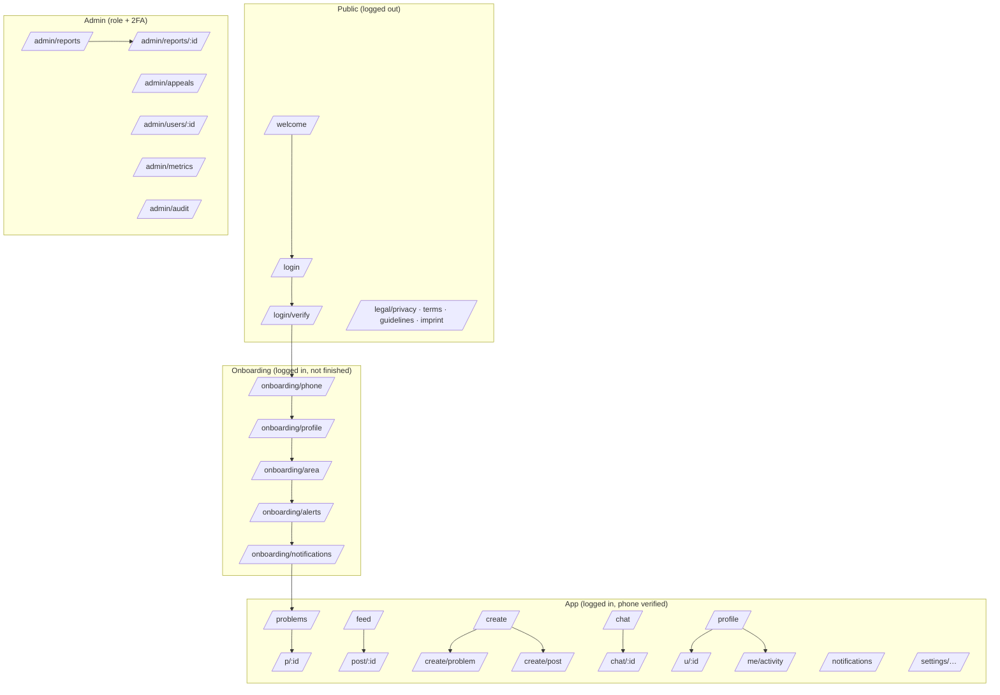

# 06 — Pages, Components & Buttons (UI Plan)

> Every page of the HelpIn web app, the components it's built from, and every button: who sees
> it, when, what it does, and which API it calls. Rule IDs (`R-`, `K-`, `A-`…) refer to
> [02 — Domain Model](02-domain-model.md). Endpoints refer to
> [03 — Architecture §10](03-architecture.md#10-api-design).
>
> **Status: planning.** No code yet.

---

## 1. UI principles

1. **Problems first.** The app opens on the map. The most important actions are always one tap
   away: *I can help*, *Report a problem*, *Confirm solved*.
2. **One primary action per screen.** Each page has exactly one filled (primary) button. Everything
   else is secondary, ghost, or in a "⋯" menu.
3. **Never colour alone.** Urgency, status and progress always show **icon + text + colour**.
4. **Mobile-first, thumb-friendly.** Primary actions sit in a sticky bottom bar on phones.
   Minimum tap target 44 × 44 px.
5. **Honest states.** Every list has a designed loading, empty, error and offline state.
6. **Confirm only what's destructive or irreversible** (withdraw, delete, block, reveal identity,
   confirm solved). Everything else acts immediately, with an undo toast where possible.
7. **Privacy is visible.** Wherever location or identity is involved, the UI says what others
   will see ("Others see an area of ~0.7 km², not your address").

---

## 2. App shell & layout

### 2.1 Breakpoints

| Width | Layout |
|---|---|
| **Phone** (< 640 px) | Top bar + content + **bottom tab bar**. Detail pages are full-screen; secondary flows open as **bottom sheets**. |
| **Tablet** (640–1023 px) | **Icon sidebar** (collapsed) + content. Sheets become centred dialogs. |
| **Desktop** (≥ 1024 px) | **Full sidebar** + content. The Problems page is **two-pane**: list on the left, map on the right, and a problem opens in a side panel without leaving the map. |

### 2.2 Shell components

```
┌────────────────────────────────────────────┐
│ TopBar:  [page title / area chip]  🔔3  👤 │   ← NotificationBell, AvatarMenu
├────────────────────────────────────────────┤
│                                            │
│                 page content               │
│                                            │
├────────────────────────────────────────────┤
│ OfflineBanner (only when offline)          │
│ RestrictedBanner (only if account limited) │
├────────────────────────────────────────────┤
│  🗺 Problems  🖼 Feed  ⊕ Create  💬 Chat  👤 Profile │  ← BottomTabBar (phones)
└────────────────────────────────────────────┘
```

| Shell element | Contents & behaviour |
|---|---|
| **BottomTabBar / Sidebar** | 5 items: **Problems · Feed · ⊕ Create · Chat · Profile**. Chat shows an unread count badge. *Create* is visually emphasised (larger, filled circle). Tapping the current tab scrolls to top / recentres the map. |
| **TopBar** | Page title (or the area chip on Problems), **🔔 NotificationBell** with unread count → `/notifications`, **AvatarMenu** (desktop only; on phones Profile is a tab). |
| **AvatarMenu** | My profile · My activity · Settings · Help & guidelines · Log out |
| **OfflineBanner** | "You're offline. Showing saved data." Submit buttons are disabled while offline; drafts are kept. |
| **RestrictedBanner** | "Your account is limited until {date}: {reason}. [Learn more] [Appeal]" (S-09) |
| **OnNoticeBanner** | "You can post 1 problem per day until {date} because helpers weren't answered." (K-13) |
| **InstallBanner** | iPhone/Safari only, after onboarding if not installed: "Add HelpIn to your Home Screen to get notifications. [Show me how]" |
| **Toasts** | Bottom-centre (above the tab bar). Success, info, error. Undo action where supported. |

---

## 3. Sitemap & routes



### Route guards (checked in this order)

| Condition | Redirect |
|---|---|
| Not logged in | `/welcome` (remembers the requested URL and returns there after login) |
| Logged in, **phone not verified** | `/onboarding/phone` (ADR-018) |
| Onboarding not finished | Next unfinished onboarding step |
| Account `restricted` | App works **read-only**; create/offer/message buttons are hidden and RestrictedBanner shows |
| `/admin/*` without admin/moderator role | 404 |
| `/admin/*` without 2FA in this session | `/admin/2fa` (ADR-023) |
| Unknown URL | 404 page with [Go to Problems] |

### Full page list

| Route | Page | Phase |
|---|---|---|
| `/welcome` | Landing / value proposition | 1 |
| `/login`, `/login/verify` | Log in or sign up with phone or email; enter code | 1 |
| `/onboarding/phone` · `/profile` · `/area` · `/alerts` · `/notifications` | 5-step onboarding | 1 |
| `/problems` | Map + list of open problems (default tab) | 2 |
| `/p/:id` | Problem tab (detail) | 2–4 |
| `/create` | Fork: Report a problem / Share a post | 2 / 5 |
| `/create/problem` | Problem wizard (7 steps) | 2 |
| `/create/post` | Post composer | 5 |
| `/feed`, `/post/:id` | Social feed; post detail with comments | 5 |
| `/chat`, `/chat/:id` | Conversations list; conversation | 3 |
| `/profile`, `/u/:id` | Own / other user's profile | 1–5 |
| `/me/activity` | My problems (incl. anonymous) · My help offers | 3 |
| `/notifications` | Notification inbox | 3 |
| `/settings/*` | Profile, alerts, notifications, privacy & blocked users, account (export/delete), about & legal | 1 |
| `/legal/*` | Privacy notice, terms, community guidelines, imprint | 1 |
| `/admin/*` | Moderation console | 6 |
| `/offline`, `/404` | System pages | 0 |

---

## 4. Design tokens (visual language)

### 4.1 Status vocabularies (always icon + label + colour)

| Vocabulary | Values |
|---|---|
| **Urgency** | 🔵 `circle` **Basic** (blue) · 🟠 `alert-circle` **Medium** (amber) · 🔴 `alert-triangle` **Serious** (red) |
| **Kind** | 🙋 `user` **Personal** · 👥 `users` **Community** |
| **Progress status** | 🔵 **Still need help** · 🟢 **Making progress** · 🟠 **Partly solved** · 🟣 **Need has changed** · ⚪ **Note** |
| **Problem status** | **Open** · ✅ **Solved** · ↩️ **Withdrawn** · ⏳ **Expired** · 🚫 **Removed** (abandoned problems show as "Closed: no activity") |
| **Offer status** (seen by helper) | **Offer sent** · **Accepted** · **Declined** · **You helped ✓** · **Closed** |

### 4.2 Foundations

| Token group | Plan |
|---|---|
| Colour | Neutral base + brand accent (to be designed); semantic tokens `--urgency-basic/medium/serious`, `--success`, `--warning`, `--danger`, `--info`; all pairs meet WCAG AA contrast; **dark mode** from day one |
| Type | System font stack (fast, no download); sizes 12 / 14 / 16 (body) / 20 / 24 / 32 |
| Spacing | 4-px grid (4, 8, 12, 16, 24, 32) |
| Radius | 8 px (inputs, chips), 12 px (cards), 20 px (sheets) |
| Icons | `lucide-react` (consistent stroke icons) + category icons |
| Motion | 150–250 ms ease-out; respects `prefers-reduced-motion` |

---

## 5. Component library

Code location: `apps/web/src/components/ui` (primitives) and `apps/web/src/components/domain`
(HelpIn-specific). Every component gets a Storybook story covering all its states, and those
stories double as visual tests.

### 5.1 Primitives (built on Radix UI + Tailwind)

| Component | Variants / notes |
|---|---|
| **Button** | `primary` (filled, one per screen) · `secondary` (outlined) · `ghost` · `danger` · sizes `sm/md/lg` · states: default, hover, pressed, **loading** (spinner + disabled), disabled · optional leading icon |
| **IconButton** | Icon-only, **always has an aria-label** |
| **Input / Textarea** | Label, helper text, error text, character counter (title 80, description 1000, update 500, message 2000) |
| **PhoneInput** | Country code (default +36) + number |
| **OtpInput** | 6 boxes, paste support, auto-submit when full, "Resend code" with countdown |
| **Select / RadioCards** | RadioCards are used for urgency, kind and precision (big tappable cards) |
| **Switch / Checkbox** | Settings toggles, consents |
| **Chip** | Filter chips (toggleable), info chips |
| **Badge** | Counts (unread), small labels |
| **Avatar** | Image or initials; the **anonymous avatar** is a neutral silhouette |
| **Tabs** | Underlined tabs (profile, activity, admin) |
| **SegmentedControl** | Map ⇄ List toggle |
| **Sheet** | Bottom sheet on phones (draggable, `vaul`), side panel/dialog on desktop |
| **Dialog** | Confirmations; destructive ones use a `danger` primary button |
| **DropdownMenu** | "⋯" overflow menus |
| **Toast** | success / info / error, with optional **Undo** |
| **Banner** | Inline page banners (info / warning / danger) |
| **EmptyState** | Illustration + title + text + optional action button |
| **Skeleton** | Loading placeholders matching each card's shape |
| **Stepper** | Wizard progress ("Step 3 of 7") with Back / Next |
| **PhotoPicker** | Add from camera/gallery, thumbnails with remove ✕, reorder by drag, upload progress per photo, retry on failure |
| **PhotoGallery / Lightbox** | Swipeable full-screen viewer |
| **RelativeTime** | "2 h ago" with exact time on hover/long-press |

### 5.2 Domain components

| Component | What it shows | Used on |
|---|---|---|
| **UrgencyBadge** | Icon + label + colour (§4.1) | Cards, problem page, wizard |
| **KindBadge** | Personal / Community | Cards, problem page |
| **CategoryIcon / CategoryPicker** | Group grid → category list (Domain §11) | Wizard, filters |
| **ProgressStatusChip** | Progress status (§4.1) | Cards, timeline |
| **FreshnessLabel** | "Updated 2 h ago" / "Asker last active 1 d ago" | Cards, problem page |
| **AskerChip** | Avatar + name + karma + reliability, **or** "Anonymous neighbour" + reliability (A-01) | Problem page, cards |
| **KarmaPill** · **ReliabilityPill** · **NeighboursHelpedStat** | Karma (can be negative) · "Responds to helpers 92%" · "Helped 14 neighbours" | Profile, AskerChip |
| **ProblemCard** | Category icon, title, UrgencyBadge, KindBadge, area name, distance band ("~1 km"), FreshnessLabel, latest ProgressStatusChip, counts (🙋 2 helping · 👥 23 affected), first photo thumbnail | Map peek list, list view, My activity |
| **MapView** | MapLibre map with layers below | Problems, wizard, problem page mini-map |
| ↳ **HexAreaLayer** | Semi-transparent hexagon per open incident, tinted by urgency | MapView |
| ↳ **IncidentMarker** | Small card marker at the cell centre; size grows with affected count (1 / 2–9 / 10+) | MapView |
| ↳ **ClusterBubble** | Count per area when zoomed out; tap = zoom in | MapView |
| ↳ **LocateMeButton** | Centres on the user's position (asks permission first time) | MapView |
| **AreaPrecisionPicker** | RadioCards: *Standard area (~0.7 km²)* · *Wider area (~5 km²)* · *Exact public spot (~0.1 km², community problems only)* + live hexagon preview | Wizard |
| **SimilarIncidentsList** | Nearby open incidents of the same category with **Same here** buttons | Wizard step 2 |
| **PinnedUpdate** | The latest asker update, highlighted at the top of the problem tab | Problem page |
| **ProgressTimeline** | Chronological updates with role labels (Asker / Helper / Affected neighbour), text, photos | Problem page |
| **ResponseClockBanner** | Asker only: "Bence is waiting for your reply. Respond within 18 h to keep your karma." + [Still need help] | Problem page, My activity |
| **ProblemActionBar** | Sticky bottom bar with role-aware buttons (§6.6) | Problem page |
| **OfferCard** | Helper avatar, name, karma, neighbours helped, message, time + Accept / Decline / Open chat | Offers section (asker) |
| **ConfirmSolvedSheet** | Choose up to 3 helpers to credit, or "Nobody, I solved it myself" | Problem page, chat, notifications |
| **UpdateComposer** | Progress status chips + text + up to 3 photos | Problem page sheet |
| **ConversationListItem** | Other person (or Anonymous neighbour), problem title chip, last message, time, unread dot, "Closed" chip | Chat list |
| **MessageBubble** | Variants: text · image · **location** (map snippet, asker-shared) · **system** ("Anna marked this solved") | Conversation |
| **MessageComposer** | Text field + 📷 photo + 📍 share location (asker only) + send | Conversation |
| **PostCard** | Author, area, time, photo carousel, caption, ❤️ count, 💬 count, "⋯" | Feed, profile |
| **CommentItem / CommentComposer** | Flat comments | Post detail |
| **NotificationItem** | Icon, text, time, unread dot, **inline action buttons** for reminders | Notifications |
| **ReportSheet** | Reason list (Fake problem, Spam, Harassment, Dangerous, Fraud, False emergency, Inappropriate, Privacy, Other) + details | Everywhere via "⋯" |
| **BlockDialog** | Explains the effects (S-03) + confirm | Profiles, chats, cards |
| **SeriousInterstitial** | Full-screen: "HelpIn is not an emergency service. If anyone is in danger, call 112." [📞 Call 112] [Continue posting] | Wizard |
| **AnonymousToggle** | "Post anonymously" + explanation of what's hidden and that HelpIn still knows (A-01, A-02) | Wizard review step |
| **InstallGuide** | Step-by-step "Share → Add to Home Screen" with screenshots (iPhone) | Onboarding, InstallBanner |
| **PushPermissionCard** | Explains why notifications matter, then triggers the browser prompt | Onboarding, settings |
| **StatementOfReasons** | What was removed, why, which rule, appeal button (S-09) | Notifications, restricted banner |

---

## 5b. Button conventions

- **Labels are verbs** that say what happens: "Send offer", "Confirm solved", not "OK"/"Submit".
- Every async button shows a **loading state** and is disabled until the server answers. All
  commands send an `Idempotency-Key` (R-07), so a double tap can never double-post.
- After success, the UI updates **optimistically** where safe (reactions, Same here) and rolls
  back with an error toast if the server rejects.
- Destructive buttons use the `danger` style and need a confirm dialog.
- Buttons the user can't use are **hidden**, not disabled, unless the reason is useful to show
  ("Offline: can't send").

---

## 6. Pages in detail

Each page lists its sections, buttons and states. In the button tables:
**Shown when** = visibility rule · **Does** = what happens · **API** = endpoint called.

### 6.1 `/welcome` — Landing

**Sections:** logo + tagline ("See a nearby problem. Help. Solve it."), 3 illustrated
value points (Map of local problems · Help your neighbours · Earn karma), Budapest-only note,
footer links to legal pages.

| Button | Shown when | Does | API |
|---|---|---|---|
| **Get started** (primary) | Always | → `/login` (sign-up mode) | — |
| **I already have an account** | Always | → `/login` (login mode) | — |
| Privacy · Terms · Guidelines · Imprint | Footer | → `/legal/*` | — |

### 6.2 `/login` and `/login/verify` — Log in / sign up

**`/login`:** SegmentedControl **Phone | Email**, PhoneInput or email Input, CAPTCHA (invisible
unless suspicious), and a consent line: "By continuing you agree to the Terms and Privacy notice."

| Button | Shown when | Does | API |
|---|---|---|---|
| **Send code** (primary) | Valid phone/email entered | Sends a 6-digit code (SMS or email), → `/login/verify` | Supabase Auth OTP |
| Phone / Email toggle | Always | Switches input | — |

**`/login/verify`:** OtpInput, "Code sent to +36 30 … 12".

| Button | Shown when | Does | API |
|---|---|---|---|
| **Verify** (primary) | 6 digits entered (auto-submits) | Logs in; new users → onboarding, others → requested page | Supabase Auth verify |
| **Resend code** | After 30 s countdown | Sends a new code (rate-limited) | Supabase Auth OTP |
| **Change number/email** | Always | ← back to `/login` | — |

**States:** wrong code → inline error, 5 tries then a 10-min lock; SMS limit hit → "Too many
attempts, try again later or use email."

### 6.3 Onboarding (5 steps, Stepper at top)

| Step | Content | Buttons |
|---|---|---|
| **1 `/onboarding/phone`** (skipped if signed up by phone) | "HelpIn needs a verified phone number to keep fake accounts out. It's never shown to anyone." PhoneInput → OtpInput | **Send code** → **Verify** (primary) · Resend code |
| **2 `/onboarding/profile`** | Display name, optional avatar (PhotoPicker, 1 photo), ☐ "I'm 18 or older" (required), ☐ "I agree to the Community Guidelines" (required, link) | **Continue** (primary; enabled when both boxes are ticked) → `PATCH /me/profile` |
| **3 `/onboarding/area`** | "Where's home? We only store a ~5 km² area, never your address." Map with a res-7 hexagon that follows the centre; LocateMeButton | **Use my location** · **Continue** (primary) → `PUT /me/home-area` · error if outside Budapest: "HelpIn is only in Budapest for now" |
| **4 `/onboarding/alerts`** | "Which problems should we tell you about?" Radius RadioCards (*My area* / *Nearby, ~2.5 km* (default) / *Wider, ~4 km*), category group chips (all on by default), minimum urgency, max alerts per day (default 5), quiet hours | **Continue** (primary) → `PUT /me/alert-prefs` · **Skip, use defaults** |
| **5 `/onboarding/notifications`** | PushPermissionCard. **iPhone not installed:** InstallGuide first. **Push blocked/unsupported:** "We'll email you instead." | **Turn on notifications** (primary) → browser prompt → `POST /me/push-subscriptions` · **Use email only** · **Show me how** (iPhone) · then **Start helping** → `/problems` |

### 6.4 `/problems` — Map & list (default tab)

**Phone layout:** full-screen map; TopBar shows the **AreaChip** ("Near Bartók Béla út · XI ▾");
floating controls; a **peek sheet** at the bottom listing the problems in view (swipe up = list).
**Desktop:** list pane (left, 400 px) + map (right).

```
┌──────────────────────────────────┐
│ [Near Bartók Béla út · XI ▾] 🔔3 │
│ [⚙ Filters (2)]       [Map|List] │
│                                  │
│      ⬡⬡      ⬡ (23)              │  ← HexAreaLayer + IncidentMarkers
│   ⬡           ⬡                  │
│                          [◎]     │  ← LocateMeButton
│ ╭──────────────────────────────╮ │
│ │ 6 problems nearby  ──        │ │  ← peek sheet (drag up)
│ │ [ProblemCard] [ProblemCard]… │ │
│ ╰──────────────────────────────╯ │
│ 🗺  🖼  ⊕  💬  👤                │
└──────────────────────────────────┘
```

| Button | Shown when | Does | API |
|---|---|---|---|
| **AreaChip ▾** | Always | Search a Budapest place or district and fly the map there | geocoding (tiles provider) |
| **Filters** | Always (badge = active filter count) | Opens FilterSheet: category groups, urgency, kind, "Needs help now" (no accepted helper yet) | — (client-side query params) |
| **Map / List** | Always | Switches view; remembers choice | — |
| **◎ Locate me** | Always | Asks location permission (first time), recentres | — |
| **Hexagon / marker tap** | On map | Highlights it and scrolls the peek sheet to its ProblemCard | — |
| **Cluster bubble tap** | Zoomed out | Zooms in on that cluster | — |
| **ProblemCard tap** | List / sheet | → `/p/:id` (desktop: opens in side panel) | — |
| **"I can help" on card** (quick action) | Card of an open problem the user can help on | Opens OfferHelpSheet without leaving the map | `POST /problems/{id}/offers` |

Data: `GET /map?bbox&zoom` on every map move (debounced 300 ms), cached per viewport.

**States**
- Loading: map tiles + skeleton cards.
- **Empty:** "No open problems near you. That's good news! 🎉 Invite neighbours so help is close
  when you need it." [Invite neighbours] (Web Share API / copy link)
- Location denied: map starts at the user's home area; banner "Turn on location to see what's
  closest."
- Outside Budapest: "HelpIn is only in Budapest for now." Map stays usable for browsing Budapest.

### 6.5 `/create` — Create fork

Two big cards: **Report a problem** (primary, large, top) and **Share a post** (secondary,
smaller). Shows today's remaining problem quota if the user is close to the limit.

| Button | Shown when | Does |
|---|---|---|
| **Report a problem** | Always (hidden if restricted) | → `/create/problem` (resumes a saved draft if one exists: "Continue your draft?") |
| **Share a post** | Feed enabled for the area | → `/create/post` |

### 6.6 `/create/problem` — Problem wizard (7 steps)

A Stepper with **Back** and **Next** on every step. The draft auto-saves to the device after
every change (survives closing the tab). **✕ Close** asks "Save draft / Discard".

| Step | Content | Buttons & behaviour |
|---|---|---|
| **1 · What's it about?** | CategoryPicker: 6 group tiles (People, Environment, Roads & public spaces, Utilities, Safety, Other) → category list | Tapping a category = **Next**. Sets default kind & urgency. |
| **2 · Is it one of these?** | SimilarIncidentsList: open incidents of the same category in this and neighbouring areas, each with title, distance, affected count, photo (R-31). Skipped automatically if none. | **Same here** on an incident → `POST /incidents/{id}/affected` → success screen "You're now following this. 24 neighbours affected" → `/p/:id`. **No, mine is different** (primary) → Next. |
| **3 · Describe it** | Title (3–80), description (≤ 1000), **Kind** RadioCards: *Personal: I need help* / *Community: affects many people* (pre-selected from category) | **Next** (enabled when title is valid) |
| **4 · Where?** | MapView centred on the user (or home area), draggable centre; AreaPrecisionPicker with live hexagon; text: "Others will see this area, not the exact spot." Optional ☐ "Save the exact spot privately so I can share it with a helper later" | **Use my location** · **Next**. Error "Outside Budapest" blocks Next. |
| **5 · Photos** (optional) | PhotoPicker, up to 6 photos. Tip: "Don't show faces or house numbers." Uploads start immediately (`POST /media/upload-url` → upload → `finalize`) | **Skip** · **Next** (waits for uploads; failed ones show Retry) |
| **6 · How urgent?** | RadioCards: Basic / Medium / Serious with one-line explanations | Selecting **Serious** opens **SeriousInterstitial** ([📞 Call 112] · [It's not an emergency, continue]). **Next** |
| **7 · Review & post** | Summary of everything (editable via "Edit" links per section) + **AnonymousToggle** (hidden if not allowed, A-05) + how many neighbours will be notified ("~40 people nearby will be told") | **Post problem** (primary) → `POST /problems` → success screen |

**Success screen:** "Your problem is live. We've told nearby helpers." Buttons: **View my
problem** (primary) → `/p/:id` · **Share link** · **Done** → `/problems`.

**Errors:** rate limit → "You've reached today's limit of N problems." · on notice →
OnNoticeBanner · outside launch area → block at step 4 · validation errors highlight the step.

### 6.7 `/p/:id` — Problem tab (the most important page)

**Sections, top to bottom:**
1. **Header:** CategoryIcon, title, UrgencyBadge, KindBadge, status (if not open), "⋯" menu
2. **Meta row:** area name + district, distance band, posted time, **FreshnessLabel**
3. **AskerChip** (or "Anonymous neighbour")
4. **ResponseClockBanner** (asker only, personal problems with helpers, R-60)
5. **PinnedUpdate** (latest asker update)
6. **Photos** (PhotoGallery)
7. **Description**
8. **Mini-map** with the hexagon (tap → full map at this spot)
9. **Counts:** "2 helping · 5 offers" / "23 neighbours affected"
10. **Offers section** (asker only): OfferCards
11. **Progress timeline**
12. **ProblemActionBar** (sticky bottom on phones)

#### Which buttons each person sees (open problem)

| Button | Anyone else | Helper: offer sent | Helper: accepted | **Asker** | Affected (community) |
|---|---|---|---|---|---|
| **I can help** | ✅ primary | — | — | — | ✅ |
| **Same here** (community only) | ✅ primary on community problems | ✅ | ✅ | — | shows "You're affected · Undo" |
| **Fixed now** (community only) | — | — | — | — | ✅ |
| **Withdraw my offer** | — | ✅ | ✅ (in ⋯) | — | — |
| **Open chat** | — | — | ✅ primary | per helper, in OfferCards | — |
| **I think it's solved** (personal only) | — | — | ✅ | — | — |
| **Post update** | — | ✅ | ✅ | ✅ secondary | ✅ |
| **Confirm solved** | — | — | — | ✅ **primary** | — |
| **Still need help** | — | — | — | ✅ (in banner, and ⋯) | — |
| **Accept / Decline** (on each OfferCard) | — | — | — | ✅ | — |
| **Withdraw problem** | — | — | — | ✅ (⋯, danger) | — |
| **Share link** | ✅ | ✅ | ✅ | ✅ | ✅ |
| **Report** · **Block user** | ✅ (⋯) | ✅ | ✅ | — | ✅ |

#### Button functions

| Button | Does | API | Rules |
|---|---|---|---|
| **I can help** | Opens **OfferHelpSheet**: optional message ("I have a ladder, can bring it at 6 pm"), [Send offer]. After sending, the bar shows "Offer sent · waiting for {asker}". | `POST /problems/{id}/offers` | R-10, R-11, R-12; starts the asker's 48 h clock on the first offer (R-52) |
| **Withdraw my offer** | Confirm dialog → offer withdrawn | `POST /offers/{id}/withdraw` | R-11 |
| **Open chat** | → `/chat/:conversationId` | — | C-01 |
| **I think it's solved** | Confirm dialog "Tell {asker} you think it's solved?" → asker gets a one-tap confirm prompt | `POST /offers/{id}/claim-solved` | R-14 |
| **Same here** | Adds you as affected; button turns into "You're affected · Undo" and the count increases (optimistic) | `POST /incidents/{id}/affected` (Undo: `DELETE`) | R-30 |
| **Fixed now** | Confirm dialog "Is it fixed where you are?" → your vote counts towards the 3-vote quorum ("2 of 3 neighbours say it's fixed") | `POST /incidents/{id}/fixed` | R-21 |
| **Post update** | Opens **UpdateComposer** sheet: progress status chips (Still need help, Making progress, Partly solved, Need has changed, Note), text (required for "Need has changed"/"Note"), up to 3 photos, [Post update]. Helpers and affected neighbours see a reduced status set. | `POST /problems/{id}/updates` | R-40…R-46; counts as a raiser response (R-53) |
| **Confirm solved** | Opens **ConfirmSolvedSheet**: list of helpers who offered (checkbox, max 3, pre-ticked: accepted helpers) + option "Nobody, I solved it myself" + note "Each helper you credit gets +10 karma; you get +2". [Confirm solved] → success: confetti, "Solved! 🎉" | `POST /problems/{id}/confirm-solved` | R-15, K-01…K-11 |
| **Still need help** | One tap, no dialog → toast "Got it, helpers know you still need help." Resets the clock | `POST /problems/{id}/still-need-help` | R-53 |
| **Accept** (OfferCard) | Accepts the helper, opens the chat with their offer message as the first message, toast with [Open chat] | `POST /offers/{id}/accept` | R-13 |
| **Decline** (OfferCard) | Confirm "Decline Bence's offer? They won't be able to offer again." | `POST /offers/{id}/decline` | R-11 |
| **Withdraw problem** | Dialog with reason RadioCards: *No longer needed* · *Solved elsewhere* · *Posted by mistake*. Text: "Withdrawing is always free, with no karma lost." [Withdraw problem] (danger) | `POST /problems/{id}/withdraw` | R-53, R-57 (always free) |
| **Credit helpers** (after "Fixed now" quorum, 72 h window) | Banner "Neighbours confirmed it's fixed. Credit anyone who helped?" → ConfirmSolvedSheet in credit mode | `POST /problems/{id}/credit` | R-22 |
| **Share link** | Web Share API (phone) or copy link + toast | — | — |
| **Report** | ReportSheet | `POST /reports` | S-04, A-06 |
| **Block user** | BlockDialog | `POST /blocks` | S-03 |

#### Closed problem views

| Status | Banner | Remaining buttons |
|---|---|---|
| Solved | "✅ Solved 2 h ago. Helped by Bence and Anna" (credited helpers) | Share · Report |
| Withdrawn | "↩️ The asker withdrew this problem" | Share · Report |
| Expired | "⏳ This problem closed after {N} days" | — |
| Abandoned | "Closed: no activity for 2 days" | — |
| Removed | Page shows "This problem was removed for breaking the community guidelines." (no content) | — |

### 6.8 `/feed` and `/post/:id` — Social feed

**`/feed`:** "Share a post" bar at the top (avatar + "What's happening in your neighbourhood?"),
then PostCards, newest first, infinite scroll. Local area + neighbouring areas (F-02).

| Button | Shown when | Does | API |
|---|---|---|---|
| **Share a post** bar | Always (not restricted) | → `/create/post` | — |
| **❤️** | Every post | Toggles like (optimistic, count updates) | `PUT/DELETE /posts/{id}/reaction` |
| **💬 {n}** | Every post | → `/post/:id` with the comment box focused | — |
| **Author name/avatar** | Every post | → `/u/:id` | — |
| **⋯ → Report / Block** | Others' posts | ReportSheet / BlockDialog | `POST /reports` / `POST /blocks` |
| **⋯ → Delete post** | Own posts | Confirm (danger) | `DELETE /posts/{id}` |

**`/post/:id`:** PostCard (full) + comments + CommentComposer.

| Button | Does | API |
|---|---|---|
| **Send** (comment) | Posts a comment (1–500 chars) | `POST /posts/{id}/comments` |
| **⋯ on comment → Report / Delete (own)** | — | `POST /reports` / `DELETE /comments/{id}` |

Empty feed: "No posts in your area yet. Be the first to share something." [Share a post]

### 6.9 `/create/post` — Post composer

PhotoPicker (1–10 photos, required), caption (≤ 500), area preview ("Visible to neighbours
around District XI"). A reminder that this is the social feed, with a link: "Need help? Report a
problem instead."

| Button | Does | API |
|---|---|---|
| **Share post** (primary) | Enabled once ≥ 1 photo has uploaded → posts → `/feed` with the new post on top | `POST /posts` |
| **Report a problem instead** | → `/create/problem` (keeps nothing; photos are purpose-locked, F-03) | — |
| **✕ Cancel** | Confirm discard if anything was added | — |

### 6.10 `/chat` and `/chat/:id` — Chat

**`/chat`:** ConversationListItems, newest activity first. Each shows the other person (or
Anonymous neighbour), the problem title chip, the last message, and an unread dot. Closed
conversations are dimmed with a "Closed" chip. Empty: "Chats start when an asker accepts your
offer, or you accept someone's. [Find someone to help]" → `/problems`.

**`/chat/:id`:**

```
┌───────────────────────────────────┐
│ ← Anna (or Anonymous neighbour) ⋯ │
│ [📌 Need help moving a sofa  ›]   │  ← problem chip → /p/:id
├───────────────────────────────────┤
│  system: Anna accepted your help  │
│              I can come at 6pm ▸  │
│ ◂ Perfect, 3rd floor, door B      │
│ ◂ [📍 Exact location: map]        │  ← only if the asker shared it
├───────────────────────────────────┤
│ [📷] [📍] [ Message…      ] [Send]│
└───────────────────────────────────┘
```

| Button | Shown when | Does | API |
|---|---|---|---|
| **Send** | Text entered, conversation writable | Sends message (appears instantly, then confirmed) | `POST /conversations/{id}/messages` |
| **📷 Photo** | Writable | Pick 1 photo → upload → send as image message | media + messages |
| **📍 Share exact location** | **Asker only**, and an exact spot was saved, or they pick one now | Dialog: "Share your exact location with Bence only? It's deleted 7 days after the problem closes." [Share location] | `POST /conversations/{id}/share-location` (L-04) |
| **Problem chip** | Always | → `/p/:id` | — |
| **⋯ → Confirm solved** | Asker, problem open | ConfirmSolvedSheet | `POST /problems/{id}/confirm-solved` |
| **⋯ → I think it's solved** | Helper, personal problem open | Same as on the problem page | `POST /offers/{id}/claim-solved` |
| **⋯ → Reveal my profile** | **Anonymous asker only**, not yet revealed | Dialog: "Bence will see your name and profile in this chat. This can't be undone." [Reveal my profile] | `POST /conversations/{id}/reveal-identity` (A-03) |
| **⋯ → Report** · **Block** | Always | ReportSheet / BlockDialog (blocking makes the chat read-only, C-04) | `POST /reports` / `POST /blocks` |
| **Long-press message → Report message** | Others' messages | ReportSheet for that message | `POST /reports` |

**Read-only state:** banner "This chat closed 48 h after the problem ended" (C-03) or "You
blocked this user". The composer is hidden.

### 6.11 `/profile` and `/u/:id` — Profile

```
┌────────────────────────────────────┐
│        (avatar)  Bence K.          │
│   Member since Oct 2026            │
│  ⭐ 120 karma · 🤝 14 neighbours   │
│  ✅ Responds to helpers 92%        │
│  [badges…]                         │
│ [Edit profile] [My activity] [⚙]   │  ← own profile only
├──────────┬──────────────┬──────────┤
│  Posts   │ Problem photos│ Solved  │  ← Tabs
├──────────┴──────────────┴──────────┤
│  photo grid / history list          │
└────────────────────────────────────┘
```

Home area is never shown on profiles (L-05). Anonymous problems never appear here (A-04).

| Tab | Content | Item tap |
|---|---|---|
| **Posts** | Grid of feed photos | → `/post/:id` |
| **Problem photos** | Grid of photos from problems the user asked (non-anonymous, not removed) and their updates | → `/p/:id` |
| **Solved history** | List: "Helped with *Need a ladder* · District XI · Oct 12 · +10" | → `/p/:id` |

| Button | Shown when | Does | API |
|---|---|---|---|
| **Edit profile** | Own | → `/settings/profile` | — |
| **My activity** | Own | → `/me/activity` | — |
| **⚙ Settings** | Own | → `/settings` | — |
| **⋯ → Report user / Block** | Others | ReportSheet / BlockDialog | `POST /reports` / `POST /blocks` |
| **Karma pill tap** | Own | Opens the karma history sheet (ledger entries with reasons, e.g. "−5: didn't respond to helpers on *Lost keys*") | `GET /me/karma` |

### 6.12 `/me/activity` — My activity (private)

Tabs: **My problems** (all statuses, **including anonymous ones** with an 🕶 badge) · **Helping**
(my offers and their status).

| Button | Shown when | Does |
|---|---|---|
| **ProblemCard tap** | Always | → `/p/:id` |
| **Still need help** (inline) | Own open personal problem with a running clock | `POST /problems/{id}/still-need-help` |
| Filter chips: *Open · Solved · Closed* | Always | Filters the list |

Each open problem with a running clock shows "Reply within 18 h".

### 6.13 `/notifications` — Inbox

Grouped *Today / This week / Earlier*. Unread items are bold with a dot.

| Button | Shown when | Does | API |
|---|---|---|---|
| **Item tap** | Always | Marks read and deep-links (table below) | `POST /me/notifications/read` |
| **Mark all as read** | Unread exist | — | `POST /me/notifications/read` |
| **Inline: Still need help · It's solved · Withdraw** | Response reminders (R-54) | Same functions as on the problem page; *It's solved* opens ConfirmSolvedSheet | as §6.7 |
| **Inline: Confirm** | "Bence thinks it's solved" | Opens ConfirmSolvedSheet | — |
| **Inline: Accept** | New offer | Accepts directly (toast with Open chat) | `POST /offers/{id}/accept` |
| **Inline: Appeal** | Statement of reasons | Opens appeal form (1 appeal per decision) | `POST /appeals` |

#### Notification → destination

| Notification | Opens |
|---|---|
| Nearby problem | `/p/:id` |
| New offer / offer accepted / declined | `/p/:id` (offers section) or `/chat/:id` |
| New message | `/chat/:id` |
| Progress update | `/p/:id#timeline` |
| Response reminder / penalty | `/p/:id` with ResponseClockBanner |
| Solved / +karma | `/p/:id` (solved banner) |
| Content removed / account limited | Statement of reasons sheet |

Push notifications open the same URLs. Action buttons inside the push itself are used where the
browser supports them.

### 6.14 `/settings` — Settings

| Section (route) | Contents | Buttons → API |
|---|---|---|
| **Profile** (`/settings/profile`) | Name, avatar, bio | **Save** → `PATCH /me/profile` |
| **Home area** (`/settings/area`) | Map with res-7 hexagon | **Save area** → `PUT /me/home-area` |
| **Alerts** (`/settings/alerts`) | Radius, categories, min urgency, daily cap, quiet hours, "Serious alerts during quiet hours", "Alerts where I am now" | **Save** → `PUT /me/alert-prefs` |
| **Notifications** (`/settings/notifications`) | Push on this device (status + toggle), email fallback, email digest | **Turn on push** / **Turn off** → `POST/DELETE /me/push-subscriptions` · **Send test notification** → `POST /me/push-subscriptions/test` |
| **Privacy & safety** (`/settings/privacy`) | Blocked users list | **Unblock** (per user) → `DELETE /blocks/{userId}` |
| **Account** (`/settings/account`) | Phone (verified ✓), email | **Change phone** (re-verify) · **Add/change email** · **Download my data** → `GET /me/export` · **Log out** · **Log out everywhere** · **Delete account** (danger) |
| **About & legal** | Guidelines, terms, privacy notice, imprint, app version, contact | Links |

**Delete account dialog:** explains what's deleted and what's anonymised (S-07), asks the user
to type `DELETE`, then [Delete my account] (danger) → `DELETE /me` → logged out → `/welcome`
with "Your account was deleted."

### 6.15 `/legal/*` — Legal pages

Privacy notice (founder as controller, ADR-025), Terms, Community Guidelines (incl. **no fake
problems**), Imprint. Plain readable pages; reachable logged out.

### 6.16 Admin console (`/admin/*`, founder only during beta)

Desktop-first layout with a sidebar: **Reports · Appeals · Users · Metrics · Audit log**.
Requires the admin role **and** 2FA in the session (ADR-023).

| Page | Contents | Buttons → effect |
|---|---|---|
| **`/admin/2fa`** | TOTP code entry (or first-time setup with QR) | **Verify** |
| **`/admin/reports`** | Queue table: severity (Serious first), target type, reason, report count, age (red if > 24 h, > 2 h for Serious), status filter | Row → detail |
| **`/admin/reports/:id`** | Content preview (as the public sees it), all reports & reasons, author summary (karma, reliability, prior actions). Anonymous author hidden behind **Reveal author** | **Dismiss** · **Hide** · **Remove** · **Restrict user** · **Fake problem penalty** · **Reveal author** (requires a written reason, logged, A-07). Every action except Dismiss opens a **StatementOfReasons** form (pre-filled template per rule, editable) that is sent to the user (S-09). |
| **`/admin/appeals`** | Open appeals with the original decision and the user's text | **Uphold decision** · **Overturn** (restores content / reverses penalty) |
| **`/admin/users/:id`** | Profile, karma ledger, problems, reports by/against, moderation history | **Restrict / Unrestrict** · **Reverse karma entry** (reason required) · **Void penalty** (system fault, R-59) |
| **`/admin/metrics`** | Liquidity per district (map + table), solve rate, abandonment rate, push opt-in by platform, report backlog | — |
| **`/admin/audit`** | Append-only list of every moderation action | Filter, export CSV |

---

## 7. Sheets & dialogs catalogue

| Sheet / dialog | Opened from | Primary button |
|---|---|---|
| OfferHelpSheet | I can help | **Send offer** |
| UpdateComposer | Post update | **Post update** |
| ConfirmSolvedSheet | Confirm solved / It's solved / chat ⋯ / notification | **Confirm solved** |
| CreditHelpersSheet (credit mode of the above) | Quorum banner | **Give credit** |
| WithdrawProblemDialog | ⋯ Withdraw problem | **Withdraw problem** (danger) |
| WithdrawOfferDialog | Withdraw my offer | **Withdraw offer** (danger) |
| DeclineOfferDialog | Decline | **Decline** (danger) |
| ClaimSolvedDialog | I think it's solved | **Tell {asker}** |
| FixedNowDialog | Fixed now | **Yes, it's fixed** |
| SeriousInterstitial | Wizard step 6 | **📞 Call 112** / **It's not an emergency, continue** |
| ShareLocationDialog | 📍 in chat | **Share location** |
| RevealIdentityDialog | Chat ⋯ | **Reveal my profile** |
| ReportSheet | ⋯ Report anywhere | **Send report** |
| BlockDialog | ⋯ Block | **Block** (danger) |
| FilterSheet | Filters | **Show {n} problems** |
| KarmaHistorySheet | Karma pill | — |
| StatementOfReasonsSheet | Notification / banner | **Appeal** |
| DeleteAccountDialog | Settings → Account | **Delete my account** (danger) |
| DiscardDraftDialog | ✕ in wizard/composer | **Save draft** / **Discard** |
| InstallGuide | Onboarding / InstallBanner | **Done** |

---

## 8. Error messages (API error code → UI)

| Code | Message | UI behaviour |
|---|---|---|
| `PROBLEM_NOT_OPEN` | "This problem has already closed." | Refresh the page to show its final state |
| `OFFER_EXISTS` | "You've already offered to help." | Show current offer state |
| `OFFER_DECLINED` | "The asker declined your offer for this problem." | Hide I can help |
| `BLOCKED` | "You can't interact with this person." | Hide actions |
| `RATE_LIMITED` | "You've reached today's limit. Try again tomorrow." | Disable the action for the day |
| `ON_NOTICE` | "You can post 1 problem per day until {date}." | OnNoticeBanner |
| `ANONYMOUS_NOT_ALLOWED` | "Anonymous posting is paused for your account until {date}." | Hide AnonymousToggle |
| `PHONE_NOT_VERIFIED` | — | Redirect to `/onboarding/phone` |
| `OUTSIDE_LAUNCH_AREA` | "HelpIn is only available in Budapest for now." | Block the location step |
| `MEDIA_TOO_LARGE` / `MEDIA_TYPE` | "This photo is too large / not supported." | Remove photo, keep others |
| `CHAT_READ_ONLY` | "This chat is closed." | Hide composer |
| `ACCOUNT_RESTRICTED` | "Your account is limited." | RestrictedBanner |
| `VALIDATION` | Field-specific messages | Inline under the field |
| Network error / timeout | "Couldn't connect. Check your internet." | Keep input; Retry button |
| 5xx | "Something went wrong on our side. Try again." | Retry; reported to Sentry |

---

## 9. Empty states (copy)

| Where | Title | Text | Action |
|---|---|---|---|
| Map | "All quiet nearby 🎉" | "No open problems around you. Invite neighbours so help is close when you need it." | Invite neighbours |
| Feed | "Nothing shared yet" | "Be the first to post something from your neighbourhood." | Share a post |
| Chat | "No chats yet" | "Chats start when someone accepts your offer to help, or you accept theirs." | Find someone to help |
| Notifications | "You're all caught up" | — | — |
| Profile · Posts | "No posts yet" | — | Share a post (own) |
| Profile · Problem photos | "No problem photos yet" | — | — |
| Profile · Solved history | "No solved problems yet" | "Help a neighbour to start your history." | Find someone to help (own) |
| My activity | "You haven't posted any problems" | — | Report a problem |
| Admin reports | "No open reports 🎉" | — | — |

---

## 10. Accessibility checklist

- Every IconButton has an `aria-label`; every image has alt text (user photos get "Photo 1 of 3
  for *{title}*").
- The map has an **equivalent list view** with the same content and actions (screen readers use
  the list).
- Focus is trapped in sheets/dialogs and returns to the trigger when they close; `Esc` closes.
- Live regions announce toasts and new chat messages.
- Colour contrast AA; urgency/status never rely on colour (§4.1).
- Full keyboard navigation on desktop, including the admin console.
- Text scales to 200% without breaking layouts.

---

## 11. Build mapping (which phase builds what)

| Phase | Pages | Key components |
|---|---|---|
| 0 | App shell, `/404`, `/offline` | Primitives, tokens, BottomTabBar/Sidebar, TopBar, Storybook |
| 1 | `/welcome`, `/login*`, onboarding, `/profile` (basic), `/settings/*`, `/legal/*` | PhoneInput, OtpInput, PushPermissionCard, InstallGuide, Avatar |
| 2 | `/problems`, `/create`, `/create/problem`, `/p/:id` (view, updates, Same here, withdraw, report) | MapView + layers, ProblemCard, CategoryPicker, AreaPrecisionPicker, SimilarIncidentsList, PhotoPicker, UpdateComposer, ProgressTimeline, SeriousInterstitial, AnonymousToggle, ReportSheet |
| 3 | `/p/:id` (offers, confirm solved), `/chat`, `/chat/:id`, `/me/activity`, `/notifications` | OfferHelpSheet, OfferCard, ConfirmSolvedSheet, MessageBubble, MessageComposer, NotificationItem, KarmaPill |
| 4 | Response clock UI, Fixed now, credit after quorum, inline notification actions | ResponseClockBanner, ReliabilityPill, FixedNowDialog, CreditHelpersSheet |
| 5 | `/feed`, `/post/:id`, `/create/post`, profile tabs | PostCard, CommentItem, CommentComposer |
| 6 | `/admin/*`, StatementOfReasons & appeals | Admin tables, StatementOfReasons, appeal form |
